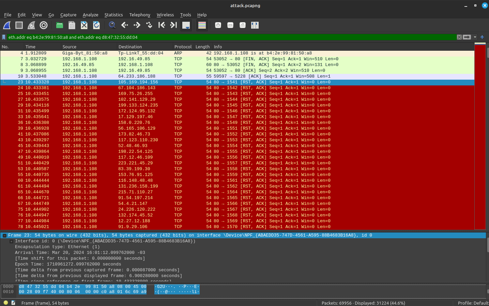

# Networking Attacks

## SYN Flood Attack

A SYN flood attack is a form of denial-of-service attack in which an attacker sends a succession of SYN requests to a target's system in an attempt to consume enough server resources to make the system unresponsive to legitimate traffic.

In this example we see around 50k requests being sent to the server, which is a lot of requests for a server to handle. This is a SYN flood attack.