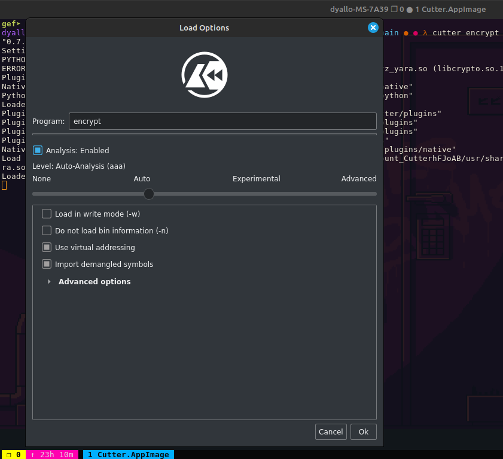
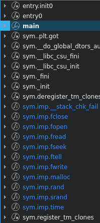
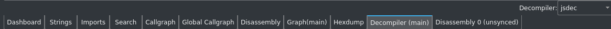

# Cutter

Cutter is a free and open-source reverse engineering platform powered by radare2. It is a graphical user interface for radare2, which is a command-line reverse engineering framework. Cutter is available for Windows, macOS, and Linux.

## Open a file

This way we can open a file in Cutter.

Once inside we can check the functions, strings, and other information about the binary.

To select the dissasembly mode check below.

This will show us a pseudo-code of the binary.