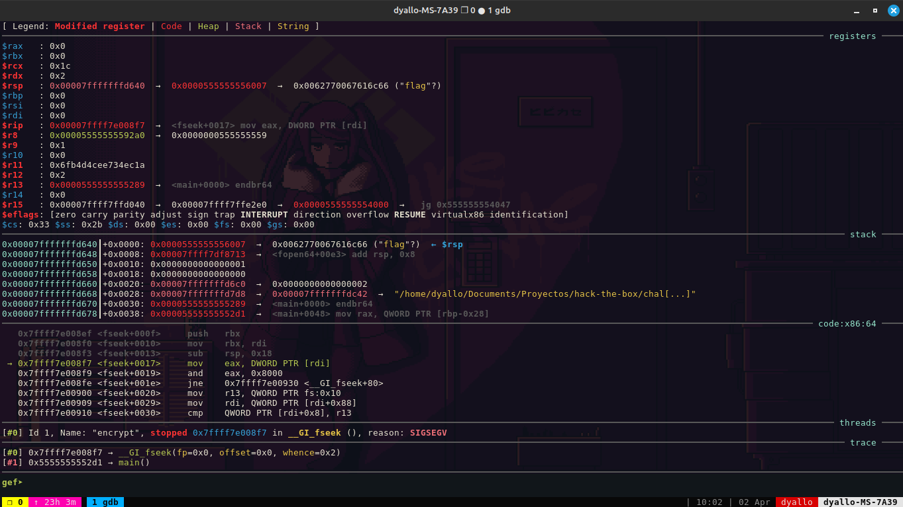

# GDB

GDB is a powerful debugger for C, C++, and other languages. It is a command-line debugger that allows you to inspect and modify the state of a program as it runs.

## Installation

- https://github.com/hugsy/gef

## Usage

```bash
gdb -q ./program
```

### Create a pattern

```bash
gef> pattern create 100
[+] Generating a pattern of 100 bytes (n=8)
aaaaaaaabaaaaaaacaaaaaaadaaaaaaaeaaaaaaafaaaaaaagaaaaaaahaaaaaaaiaaaaaaajaaaaaaakaaaaaaalaaaaaaamaaa
[+] Saved as '$_gef0'
```

### Use a pattern

```bash
gef> gef run $_gef0
```



Where:

`[#0] Id 1, Name: "encrypt", stopped 0x7ffff7e008f7 in __GI_fseek (), reason: SIGSEGV` is the location and function where the program crashed.

### Find the offset

```bash
gef> pattern offset aaaaaaae
[+] Searching 'aaaaaaae' in pattern of 100 bytes
[+] Pattern 'aaaaaaae' first occurrence at position 36
```