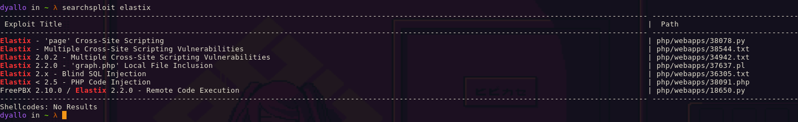

# Searchsploit

Searchsploit is a command line search tool for Exploit Database that also allows you to take a look at the exploit details. It is a part of the Exploit Database project.

```bash
searchsploit <search_term>
```

## Example

```bash
searchsploit elastix
```



Then you can use

```bash
searchsploit -x php/webapps/37637.sh >> 37637.pl
perl 37637.pl
```