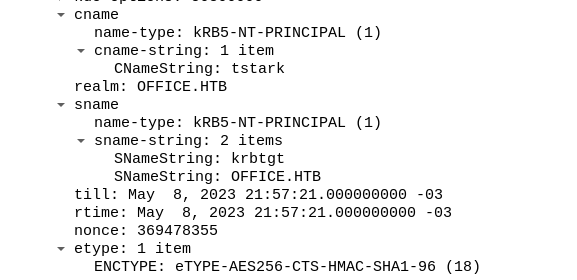
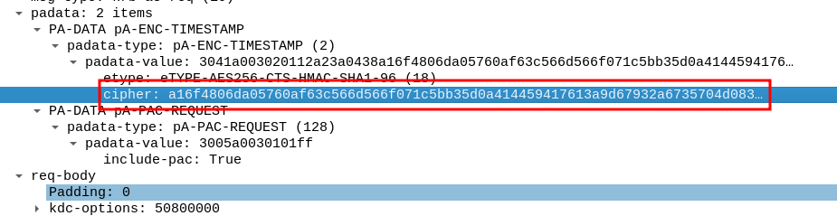
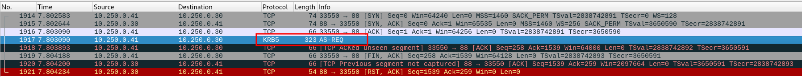

# Wireshark

Wireshark is a network protocol analyzer that can be used to capture and analyze network traffic. It is commonly used to troubleshoot network issues, monitor network activity, and analyze network security.

## Cipher in Kerberos

When analyzing network traffic with Wireshark, you may come across Kerberos authentication packets that contain a cipher. The cipher is a hash of the user's password and can be cracked to recover the plaintext password.

