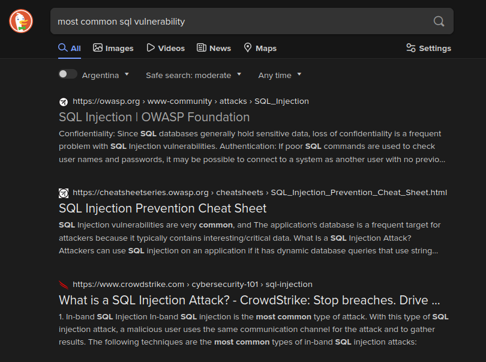
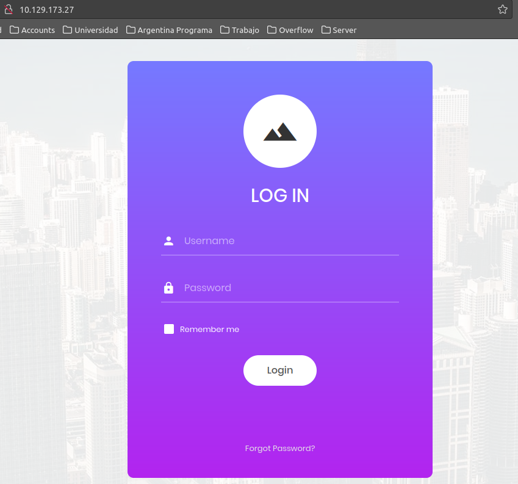

# Appointment

## Tags

Databases
Apache
MariaDB
PHP
SQL
Reconnaissance
SQL Injection

1. What does the acronym SQL stand for?

Response: Structured Query Language

2. What is one of the most common type of SQL vulnerabilities?



Response: SQL Injection

3. What is the 2021 OWASP Top 10 classification for this vulnerability? 

https://owasp.org/Top10/

Response: A03:2021-Injection

4. What does Nmap report as the service and version that are running on port 80 of the target? 

```bash
nmap -sV 10.129.127.97                    
Starting Nmap 7.80 ( https://nmap.org ) at 2024-02-06 23:34 -03
Nmap scan report for 10.129.127.97 (10.129.127.97)
Host is up (0.20s latency).
Not shown: 999 closed ports
PORT   STATE SERVICE VERSION
80/tcp open  http    Apache httpd 2.4.38 ((Debian))
```

Response: Apache httpd 2.4.38

5. What is the standard port used for the HTTPS protocol? 

Response: 443

6. What is a folder called in web-application terminology? 

Response: Directory

7. What is the HTTP response code is given for 'Not Found' errors? 

Response: 404

8. Gobuster is one tool used to brute force directories on a webserver. What switch do we use with Gobuster to specify we're looking to discover directories, and not subdomains? 

Response: dir

9. What single character can be used to comment out the rest of a line in MySQL? 

Response: #

10. If user input is not handled carefully, it could be interpreted as a comment. Use a comment to login as admin without knowing the password. What is the first word on the webpage returned? 

Response: Congratulations

11. Submit the flag you found on the page.

In odrder to obtain the flag we should enter the page of the IP



We can guest from the question 10 that username is not handled carefully, so we can use a comment to login as admin without knowing the password. 


Once we click login we should see the flag


At this point we have done something like this

```sql
SELECT * FROM users where username='admin'#' AND password='a';
```