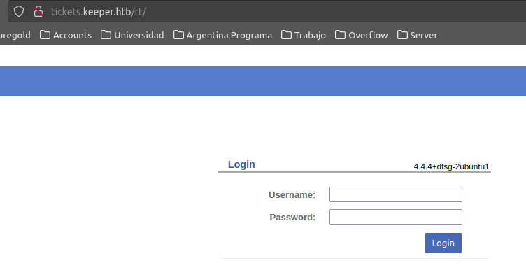

# Keeper

```bash
user in ~ λ telnet 10.10.11.227 22
Trying 10.10.11.227...
Connected to 10.10.11.227.
Escape character is '^]'.
SSH-2.0-OpenSSH_8.9p1 Ubuntu-3ubuntu0.3
```

```bash
nmap -Pn 10.10.11.227
Starting Nmap 7.80 ( https://nmap.org ) at 2024-01-24 21:37 -03
Nmap scan report for 10.10.11.227 (10.10.11.227)
Host is up (0.20s latency).
Not shown: 998 closed ports
PORT   STATE SERVICE
22/tcp open  ssh
80/tcp open  http
```

At first I tried to find something about that particular OpenSSH version. I found that 8.6<= has this

```
The client side in OpenSSH 5.7 through 8.6 has an Observable Discrepancy leading to an information leak in the algorithm negotiation. This allows man-in-the-middle attackers to target initial connection attempts (where no host key for the server has been cached by the client).
```

But no point here since we got 8.9

I've also found that you can get public keys from github like this

```
curl https://github.com/<user>.keys
```

But also no point here since I don't have any user to try

So next one is going though the webserver

Entering the IP I got a message with 2 domains

```
keeper.htb
tickets.keeper.htb
```

Since I already have the IP, I can add it to my /etc/hosts file

```
10.10.11.227 keeper.htb tickets.keeper.htb
```

Once we enter the page we see something like this



Since this RT system is a third party software, I tried to find the default credentials for it. I found that the default credentials are root:password

https://rt-wiki.bestpractical.com/index.php?title=RecoverRootPassword

Once inside the app I'll go into admin, and there is a user called lnorgaard


His information is there


Now we can SSH into the server

```bash
ssh lnorgaard@keeper.htb
```

Password was `Welcome2023!`

Inside the home of `lnorgaard` is a file called user.txt here we have our first flag